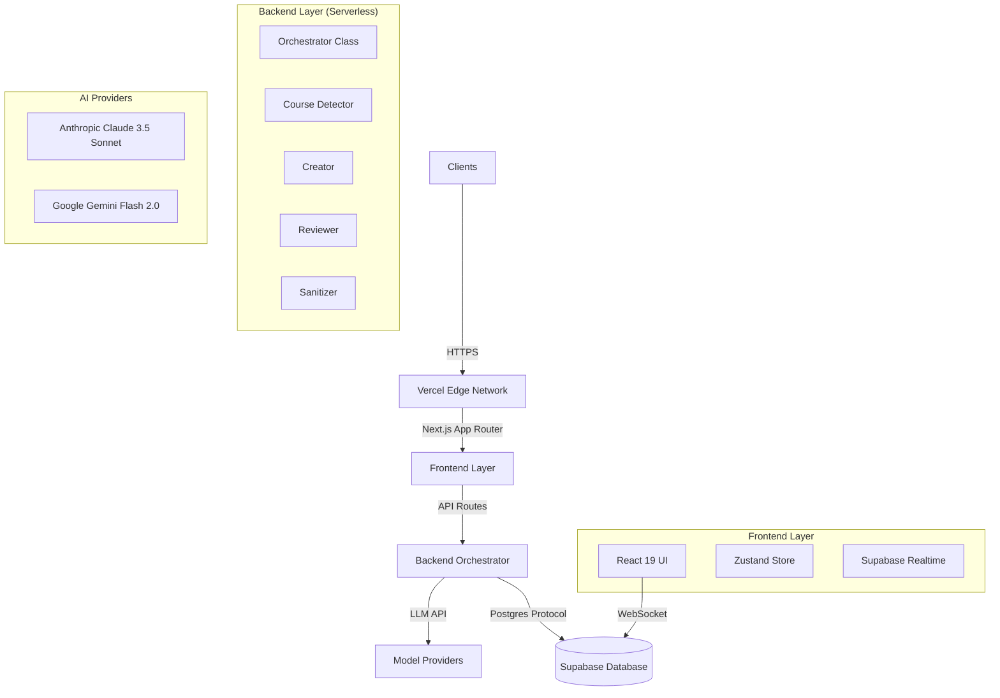

# Generative Content Creation Platform (GCCP) Technical Documentation

> **Version:** 2.0.0
> **Last Updated:** February 2026
> **Status:** Production-Ready

## 1. Executive Overview

The **Generative Content Creation Platform (GCCP)** is an enterprise-grade, AI-driven educational content generation system. It automates the transformation of high-level topics and raw transcripts into structured, pedagogically sound educational artifacts.

### 1.1 Core Value Proposition

- **Time Efficiency:** Reduces content creation time from days to minutes through parallelized AI agent execution.
- **Pedagogical Rigor:** Enforces strict educational standards using a multi-stage `Draft -> Sanitize -> Critique -> Refine` pipeline.
- **Domain Adaptation:** Dynamically adjusts tone, vocabulary, and examples based on the detected subject domain (e.g., _Physics_ vs. _Marketing_).
- **Structured Output:** Delivers content in strictly validated JSON and Markdown formats, ensuring compatibility with LMS platforms.

### 1.2 User Personas

| Persona                  | Goal                                         | Key Features Used                          |
| :----------------------- | :------------------------------------------- | :----------------------------------------- |
| **Curriculum Developer** | Rapidly prototype course modules.            | Topic-to-Content Generation, Gap Analysis. |
| **Instructor**           | Convert lecture recordings into study notes. | Transcript Upload, Assignment Generation.  |
| **Administrator**        | Monitor usage and quality trends.            | Dashboard, Meta-Quality Analysis.          |

---

## 2. System Architecture

The GCCP utilizes a **Serverless Multi-Agent System** architecture, hosted on Vercel (Next.js) with Supabase as the stateful backbone.

### 2.1 High-Level Architecture



### 2.2 Core Design Patterns

1.  **Orchestrator Pattern:** A central `Orchestrator` class manages the lifecycle of all agents. It handles state transitions, error recovery, and result aggregation. Agents _never_ call each other directly; they only communicate via the Orchestrator.
2.  **Streaming-First:** All long-running operations utilize Server-Sent Events (SSE) to provide feedback. The frontend renders these streams in real-time.
3.  **Optimistic UI:** The interface updates immediately on user action, reverting only if the background operation fails.
4.  **Row Level Security (RLS):** Security is enforced at the database level. The API uses a Service Role to bypass RLS for system tasks, while the frontend is strictly bound by user policies.

---

## 3. Directory Structure (Deep Dive)

This directory contains the logic for all autonomous agents.

- `base-agent.ts`: Abstract class defining the `generate()` interface and error handling.
- `orchestrator.ts`: The "Brain". Manages the state machine: `Detection -> Drafting -> Review -> Refinement`.
- `creator.ts`: Generates initial drafts. Uses `Claude 3.5 Sonnet` for high reasoning.
- `reviewer.ts`: Acts as a "Critical Teacher", scoring content 1-10.
- `refiner.ts`: The "Editor". Applies surgical fixes based on Reviewer feedback.
- `formatter.ts`: Ensures output compliance (JSON/Markdown structure).
- `sanitizer.ts`: Fact-checks content against transcripts.

### 3.2 `src/app/` - Application Router

- `editor/page.tsx`: The monolithic editor controller. Manages the `GenerationForm`, `EditorPanel`, and streaming connections.
- `api/stream/route.ts`: Examples of the Edge Runtime API route for long-running streams.
- `api/jobs/route.ts`: Background job processing for non-blocking generation.

### 3.3 `src/lib/store/` - State Management

- `generation.ts`: A specialized Zustand store that handles:
  - **Throttled Updates:** Buffers high-speed tokens from the LLM to prevent React render thrashing.
  - **Persistence:** Saves draft state to `localStorage` to prevent data loss on reload.

---

The project follows a standard Next.js App Router structure, with a strong separation of concerns between UI, Logic, and Data.

### Root Directory

- `src/`: Contains all application source code.
- `supabase/`: Contains database migrations, seed data, and configuration.
- `public/`: Static assets.

### `src/` Directory Breakdown

#### `src/app/` (Routes)

The routing layer of the application.

- `api/`: Backend API routes (e.g., `api/generate`, `api/stream`).
- `editor/`: The main workspace for content generation (`page.tsx` contains the core UI).
- `auth/`: Authentication callback routes.
- `admin/`: Admin dashboard routes.
- `layout.tsx`: Root layout defining global providers and styles.

#### `src/lib/` (Core Logic)

The heart of the application, containing utilities and business logic.

- `src/lib/agents/`: **Critical Directory.** Contains the AI agent definitions.
  - `orchestrator.ts`: The main controller class that manages the generation lifecycle.
  - `base-agent.ts`: Abstract base class for all agents.
  - `course-detector.ts`: Agent for identifying domain context.
  - `creator.ts`: Agent for drafting content.
  - `reviewer.ts` & `refiner.ts`: Agents for the quality control loop.
  - `formatter.ts`: Agent for structuring output.
- `src/lib/supabase/`: Client and Server Supabase initialization.
- `src/lib/store/`: Zustand stores for client-side state (e.g., `generation.ts`).
- `src/lib/utils/`: Shared helper functions (logging, formatting).

#### `src/components/` (UI)

Reusable React components.

- `ui/`: Primitive components (buttons, inputs, cards).
- `editor/`: Specific components for the editor view (e.g., `EditorPanel`, `PreviewPanel`).

#### `src/types/` (TypeScript Definitions)

Global type definitions.

- `database.ts`: Auto-generated Supabase types.
- `content.ts`: Types for AI generation parameters and results.

---

## 4. AI Agent Ecosystem (Deep Dive)

The core intelligence of GCCP resides in its specialized agents. Each agent is a distinct AI entity with a specific role, system prompt, and set of constraints. They operate in a linear pipeline orchestrated by the backend.

### 4.1 Agent Orchestration

The `Orchestrator` class (`src/lib/agents/orchestrator.ts`) is the central controller. It does not generate content itself but manages the flow of data between agents.

**Key Responsibilities:**

- **State Management:** Tracks the current step (Detection -> Drafting -> Review).
- **Error Handling:** Implements exponential backoff for API failures.
- **Stream Management:** Pushes real-time updates to the frontend via Server-Sent Events (SSE).
- **Dependency Injection:** Injects the appropriate model provider (Claude vs. Gemini) based on the task complexity.

### 4.2 Agent: Course Detector (`CourseDetectorAgent`)

- **Role:** The "Librarian".
- **Model:** `Gemini Flash 2.0` (Fast, low cost).
- **Input:** User Topic + Subtopics.
- **Output:** `CourseContext` JSON object.
- **Logic:**
  - Analyzes the topic to determine the academic domain (e.g., "Computer Science", "History", "Physics").
  - Selects an appropriate "Persona" for the Creator agent (e.g., "Senior Systems Architect" vs. "Tenured History Professor").
  - Determines the target audience level (Beginner/Intermediate/Advanced).
  - **Safety:** Rejects unsafe or violates topics immediately.

### 4.3 Agent: Creator (`CreatorAgent`)

- **Role:** The "Author".
- **Model:** `Claude 3.5 Sonnet` (High reasoning, creative).
- **Input:** Topic, Subtopics, Course Context, Transcript (optional).
- **System Prompt Strategy:**
  - **Role Assumption:** Adopts the specific persona defined by the Course Detector.
  - **Anti-Hallucination:** Strictly bounded by the provided transcript (if present). Use of `<transcript>` XML tags for context grounding.
  - **Formatting Rules:** Enforces strict Markdown hierarchy (`#`, `##`, `###`).
  - **Pedagogy:** Instructed to use Socratic questioning, analogies, and concrete examples.
  - **Anti-Duplication:** Checks for repetitive headers or content blocks.

### 4.4 Agent: Reviewer (`ReviewerAgent`)

- **Role:** The "Critical Teacher".
- **Model:** `Claude 3.5 Sonnet`.
- **Input:** The Draft generated by the Creator.
- **Output:** Structured `ReviewResult` (JSON).
- **Scoring Rubric (1-10):**
  1.  **Accuracy:** Is the content factually correct based on the inputs?
  2.  **Clarity:** Is the language accessible and clear?
  3.  **Structure:** Does it follow a logical flow?
  4.  **Formatting:** Are Markdown elements used correctly?
- **Logic:**
  - If `score < 9`, it generates specific "Actionable Feedback" items.
  - It identifies specific line numbers or sections that need improvement.

### 4.5 Agent: Refiner (`RefinerAgent`)

- **Role:** The "Editor".
- **Model:** `Claude 3.5 Sonnet`.
- **Input:** Original Draft + Reviewer Feedback.
- **Workflow:**
  - Uses a "Search and Replace" block strategy to minimize token usage. Instead of rewriting the whole document, it emits:

    ```markdown
    <<<<SEARCH
    Original poorly written paragraph...
    ====
    improved and polished paragraph...

    > > > >
    ```

  - **Preservation:** Explicitly instructed _not_ to change the deeper meaning or voice of the content, only to fix the identified issues.

### 4.6 Agent: Formatter (`FormatterAgent`)

- **Role:** The "Typesetter".
- **Input:** Finalized Text.
- **Output:** Validated JSON/Markdown.
- **Logic:**
  - **Assignment Mode:** Parses text into a strict JSON schema for questions (`MCSC`, `MCMC`, `Subjective`).
  - **Validation:** Uses `zod` schemas to ensure the output matches the frontend's expectations (e.g., distinct options, valid answer keys).
  - **Fallback:** If parsing fails, it attempts a "Self-Repair" pass to fix broken JSON syntax.

### 4.7 Agent: Sanitizer (`SanitizerAgent`)

- **Role:** The "Fact Checker".
- **Input:** Draft Content + Original Transcript.
- **Logic:**
  - Performs a "Claim Extraction" pass.
  - Verifies each claim against the source transcript.
  - **RAG-Lite:** Uses a sliding window approach to find supporting evidence in the transcript.
  - **Correction:** If a claim is unsupported, it rewrites the sentence to be strictly neutral or removes it.

### 4.8 Agent: Assignment Sanitizer (`AssignmentSanitizerAgent`)

- **Role:** The "Exam Proctor".
- **Input:** Generated Questions.
- **Logic:**
  - **Duplicate Check:** Ensures no two questions test the exact same concept in the same way.
  - **Ambiguity Check:** Ensures distractors (wrong answers) are plausible but clearly incorrect.
  - **Solvability:** Verifies that the question contains all necessary information to be solved.

---

## 5. Application Flow & User Journey

The Core user journey revolves around the "Generation Cycle," where a user inputs a topic and receives a complete course module.

### 1. Initiation (Frontend)

- **User Action:** The user navigates to the Editor, enters a Topic and Subtopics (and optionally uploads a transcript), and clicks "Generate".
- **Validation:** The `GenerationForm` component validates input and triggers a POST request to `/api/stream`, subscribing to server-sent events.

### 2. Orchestration (Backend)

- **API Layer:** The `/api/stream` endpoint instantiates the `Orchestrator` class.
- **Course Detection:** The `CourseDetector` agent analyzes the topic to determine the domain (e.g., "Computer Science") and sets context for downstream agents.
- **Gap Analysis (Optional):** If a transcript is provided, the `Analyzer` agent compares it against the subtopics to identify missing information.
- **Drafting:** The `Creator` agent generates the initial content draft, incorporating the course context and filling gaps.
- **Sanitization:** The `Sanitizer` agent cross-references the draft with the transcript to ensure factual accuracy.
- **Quality Loop:** The `Reviewer` agent scores the content. If the score is below threshold (e.g., 9/10), the `Refiner` agent improves specific sections. This loop repeats up to 3 times.
- **Formatting:** The `Formatter` agent converts the finalized text into the structured JSON format required for the UI.

### 3. Delivery

- **Streaming:** As each agent completes its task, the Orchestrator streams partial results (logs, status updates, content chunks) back to the client via Server-Sent Events (SSE).
- **Completion:** The final content is saved to the `generations` table in Supabase.
- **Frontend Update:** The Editor displays the final rendered content (Markdown/JSON).

---

## 6. Data Layer & Security (Deep Dive)

The database is designed to be relational and strictly typed, ensuring data integrity across the generation lifecycle.

### 6.1 Schema Overview

#### 6.1.1 `profiles` (Table)

Extends the default Supabase Auth user table.

- `id` (UUID): Primary Key, references `auth.users.id`.
- `email` (TEXT): User's email address.
- `role` (ENUM): 'admin' or 'user'.
- `credits` (INTEGER): Balance for usage limits (Default: 100).
- `spent_credits` (INTEGER): Total credits consumed by this user.
- `created_at` (TIMESTAMPTZ): Signup timestamp.

#### 6.1.2 `generations` (Table)

The core entity representing a single piece of generated content.

- `id` (UUID): Primary Key.
- `user_id` (UUID): Foreign Key to `profiles`.
- `topic` (TEXT): The main subject.
- `subtopics` (TEXT): Detailed structure/outline.
- `mode` (ENUM): 'pre-read', 'lecture', 'assignment'.
- `status` (ENUM): 'queued', 'processing', 'drafting', 'critiquing', 'refining', 'formatting', 'completed', 'failed'.
- `current_step` (INTEGER): Tracks progress (0-100) for UI bars.
- `transcript` (TEXT): Optional input text (stored as raw text).
- `final_content` (TEXT): The raw markdown output.
- `assignment_data` (JSONB): Structured question data (MCSC/MCMC/Subjective).
- `gap_analysis` (JSONB): Results from the Sanitizer comparing transcript vs subtopics.
- `instructor_quality` (JSONB): Assessment of the transcript's teaching quality (Score, Strengths, Weaknesses).
- `meta_analysis_completed` (BOOLEAN): Flag for admin-side quality aggregation.
- `estimated_cost` (NUMERIC): Calculated cost of the generation in USD.

#### 6.1.3 `generation_logs` (Table)

Stores the step-by-step execution history for UI visualization and debugging.

- `id` (UUID): Primary Key.
- `generation_id` (UUID): Foreign Key to `generations`.
- `agent_name` (TEXT): The agent responsible (e.g., "Creator", "Reviewer").
- `message` (TEXT): Human-readable status message.
- `log_type` (ENUM): 'info', 'success', 'warning', 'error', 'step'.
- `metadata` (JSONB): Usage stats, token counts, or specific debug info.

#### 6.1.4 `meta_feedback` (Table)

Stores aggregated quality metrics for system-wide analysis.

- `mode` (content_mode): 'lecture', 'assignment', etc.
- `feedback_content` (JSONB): Aggregated scores for Formatting, Pedagogy, Clarity, etc.

### 6.2 Security & Policies (RLS)

Row Level Security (RLS) is strictly enforced.

| Table           | Policy Name     | Logic                  |
| :-------------- | :-------------- | :--------------------- |
| `profiles`      | Users view own  | `auth.uid() = id`      |
| `generations`   | Users view own  | `auth.uid() = user_id` |
| `generations`   | Admins view all | `is_admin() = true`    |
| `meta_feedback` | Admins only     | `is_admin() = true`    |

**Service Role Note:** The backend API uses the `SUPABASE_SERVICE_ROLE_KEY` to bypass these policies when writing logs or updating statuses on behalf of the user during background jobs.

---

## 7. API Reference (Deep Dive)

The backend API is primarily internal, serving the Next.js frontend.

### Endpoints

#### `POST /api/stream`

**Purpose:** Triggers a generation and streams the response.

- **Body:** `{ topic: string, subtopics: string, mode: 'lecture' | 'assignment', transcript?: string }`
- **Response:** Server-Sent Events (SSE) stream containing text chunks and agent status events.
- **Authentication:** Requires valid session cookie.

#### `POST /api/generate`

**Purpose:** Triggers a background generation (non-streaming).

- **Body:** Same as `/api/stream`.
- **Response:** `{ generationId: UUID, status: 'queued' }`.
- **Behavior:** Enqueues the job and returns immediately. The client polls or listens to Realtime for updates.

#### `GET /api/export`

**Purpose:** Downloads generation history.

- **Query Params:** `?format=json|csv`
- **Authentication:** Admin only.

#### `POST /api/retry/[id]`

**Purpose:** Retries a failed generation from the last successful checkpoint.

- **Params:** `id` (Generation UUID).

---

## 8. Authentication & Authorization

The system relies on Supabase Auth for identity management and Row Level Security (RLS) for data protection.

### Authentication Flow

1.  **Login:** Users sign in via `/login` using Email/Password or efficient Magic Links.
2.  **Session:** Supabase manages the session, storing the JWT in an `sb-access-token` cookie.
3.  **Middleware:** `src/middleware.ts` intercepts requests to protected routes (`/editor`, `/api/*`). verified sessions are allowed; invalid sessions are redirected to `/login`.

### Authorization

- **Role-Based Access Control (RBAC):** The `profiles.role` column determines access.
- `user`: Can generate content and view their own history.
- `admin`: Can view all generations, system logs, and access the `/admin` dashboard.
- **Service Role:** The API uses the **Supabase Service Role Key** for background operations that need to bypass RLS (e.g., the `Orchestrator` writing logs for a user).

---

## 9. Frontend Ecosystem (Deep Dive)

The frontend is a sophisticated Single Page Application (SPA) built on Next.js 16, utilizing a "Smart-Client, Dumb-Pipe" architecture where the UI handles significant state logic while the backend streams raw data.

### 9.1 Core Components

#### 9.1.1 Editor Page Controller (`src/app/editor/page.tsx`)

The `EditorContent` component acts as the main orchestrator for the client side.

- **State Hydration:** Loads `generation.ts` store data on mount.
- **WebSocket Connection:** Subscribes to Supabase Realtime channels for the specific `generation_id` to receive status updates.
- **Layout Management:** Toggles between `Lecture` (Split View: Editor + Preview) and `Assignment` (Full Width Workspace) modes.
- **Queued Jobs:** Displays a notification banner for background jobs.

#### 9.1.2 Assignment Workspace (`src/components/editor/AssignmentWorkspace.tsx`)

A complex interactive data-grid for managing generated questions.

- **Table Mode:** A spreadsheet-like view for rapid editing of questions, options, and answers.
- **Reference Mode:** A polished, student-facing view to preview how the assignment will look in an LMS.
- **CSV Export:** Client-side generation of CSV files for LMS import.

#### 9.1.3 Gap Analysis Panel (`src/components/editor/GapAnalysis.tsx`)

Visualizes the semantic difference between the user's intent and the provided material.

- **Coverage Map:** Uses color-coded indicators (Green/Yellow/Red) to show which subtopics were found in the transcript.
- **Instructor Quality:** Displays a 10-point pedagogical score with breakdown (e.g., "Concept Clarity", "Engagement").

### 9.2 State Management Strategy

We use **Zustand** (`src/lib/store/generation.ts`) for its performance benefits over Context API.

- **Token Buffering:** The store implements a custom "Throttled Buffer".
  - _Problem:_ LLMs stream tokens at 100ms intervals, causing React to re-render 10x/second.
  - _Solution:_ Incoming chunks are pushed to a `contentBuffer` variable (outside React state). A `flush` function updates the actual React state only once every 150ms, ensuring smooth 60fps scrolling.
- **Persistence:** The store automatically syncs key fields (`topic`, `transcript`, `finalContent`) to `localStorage` using `persist` middleware, protecting users against accidental tab closures.

### 9.3 Design System ("Deep Cosmos")

The UI follows a distinct aesthetic pattern defined in `globals.css` and Tailwind config.

- **Glassmorphism:** Heavy use of `backdrop-blur-md` and `bg-white/80` overlays.
- **Aurora Gradients:** Animated background blobs using `framer-motion` to create a living interface.
- **Typography:** Uses `Inter` for UI elements and a custom `Monospace` stack for the editor.

---

## 10. Configuration & Environment

The application requires specific environment variables to function. These should be set in `.env.local` for development and in the Vercel dashboard for production.

| Variable                        | Description                                  | Required |
| :------------------------------ | :------------------------------------------- | :------- |
| `NEXT_PUBLIC_SUPABASE_URL`      | Your Supabase project URL.                   | Yes      |
| `NEXT_PUBLIC_SUPABASE_ANON_KEY` | Public API key for client-side requests.     | Yes      |
| `SUPABASE_SERVICE_ROLE_KEY`     | Secret key for backend administrative tasks. | Yes      |
| `ANTHROPIC_API_KEY`             | API key for Claude 3.5 Sonnet (generation).  | Yes      |
| `GOOGLE_GENERATIVE_AI_API_KEY`  | API key for Gemini Flash (detection).        | Yes      |

---

## 11. Build & Deployment

### Development Setup

1.  **Prerequisites:** Node.js 20+, npm/pnpm.
2.  **Install:** `npm install`
3.  **Environment:** Copy `.env.local.example` to `.env.local` and populate keys.
4.  **Run:** `npm run dev` (Starts server at `http://localhost:3000`).

### Production Build

1.  **Build Command:** `npm run build`

- Runs `next build` to compile the app.
- Optimizes static assets and generates serverless functions.

2.  **Start:** `npm start` (for local production test).

### Deployment (Vercel)

The project is optimized for deployment on Vercel.

- **Push to Git:** Connect the repository to Vercel.
- **Environment:** Add the production environment variables in the Vercel project settings.
- **Deploy:** Vercel automatically builds and deploys branches on push.

---

## 12. Testing, Dependencies, & Troubleshooting

### Testing Strategy

Currently, the project relies primarily on manual verification due to the subjective nature of AI generation.

- **Unit Tests:** (Planned) Standard Jest/Vitest setup for utility functions.
- **Integration Tests:** (Planned) Playwright E2E tests for the generation flow.
- **Evaluation:** The "Reviewer" agent acts as an automated quality tester for every generation.

### Key Dependencies

- **`@supabase/supabase-js`**: Database and Auth client.
- **`@google/generative-ai`** & **`@anthropic-ai/sdk`**: AI model interaction.
- **`zustand`**: Lightweight state management.
- **`lucide-react`**: Iconography.
- **`marked`** / **`react-markdown`**: Content rendering.

### Troubleshooting

- **Agent Timeouts:**
- _Symptom:_ Generation stuck at "Drafting..." for > 2 mins.
- _Fix:_ Check Vercel function timeout limits (default 10s on free tier, need Pro for longer). Configure `maxDuration` in route segments.
- **Rate Limits:**
- _Symptom:_ 429 Errors in console.
- _Fix:_ Check Anthropic/Google quotas. Implement exponential backoff (already in `start-agent.ts`).
- **Database Policies:**
- _Symptom:_ "Permission denied" on insert/select.
- _Fix:_ Check `supabase/migrations` RLS policies. User ID must match `auth.uid()`.

---

## 13. Coding Standards & Future Considerations

### Coding Conventions

- **TypeScript:** Strict mode enabled. No `any` types unless absolutely necessary.
- **Components:** Functional components with Hooks. Atomic design structure ($UI \rightarrow Composite \rightarrow Page$).
- **Agents:** All agents must extend `BaseAgent` and implement `getSystemPrompt()`.

### Future Roadmap

- **Model Agnosticism:** Abstracting the AI provider layer to support OpenAI/Mistral easily.
- **Canvas Editor:** Moving from a linear markdown editor to a block-based canvas (Notion-style).
- **User Templates:** Allowing administrative users to define custom prompts/templates for new content types.
- **Eval Framework:** Building a dedicated "Evaluation" mode to batch-test prompts against a "Golden Dataset" of transcripts.

---

## 14. User Guide (Step-by-Step)

This section outlines the standard workflows for end-users (Curriculum Developers and Instructors).

### 14.1 Dashboard & Orientation

Upon logging in, you are greeted by the **Dashboard**.

1.  **Credit Balance:** Top right corner shows your remaining credits.
2.  **Recent Activity:** A list of your last 5 generations.
3.  **New Project:** Click the primary absolute button to start a new generation.

### 14.2 Creating Content (The Editor)

Navigate to `/editor` to begin.

**Step 1: Input Configuration**

- **Topic:** Enter a high-level subject (e.g., "Introduction to Thermodynamics").
- **Subtopics:** Paste your syllabus or outline. _Tip: Be specific here to guide the AI._
- **Mode:** Select one of:
  - `Pre-read`: Introductory material for students.
  - `Lecture`: Detailed instructor notes and speaking points.
  - `Assignment`: Quiz questions and problem sets.
- **Transcript (Optional):** Upload a `.txt` file of a previous lecture. The AI will strictly ground its content in this text.

**Step 2: Generation**

- Click **"Generate Content"**.
- **Assessment:** The `Gap Analysis` panel will first light up, showing which subtopics were found in your transcript.
- **Streaming:** The "Console" panel will show real-time logs (e.g., `[Creator] Drafting content...`).
- **Preview:** The main document view will stream the text in real-time.

**Step 3: Export**

- Once completed, use the **Export** menu to download as Markdown or PDF.
- For Assignments, you can export a `.csv` compatible with Canvas/Blackboard.

---

## 15. Admin Guide (Privileged Capabilities)

Administrators have elevated access to strict oversight tools. Admin status is strictly strictly controlled via the database (`profiles.role = 'admin'`).

### 15.1 User Management (`/users`)

Accessible via the "Users" sidebar item.

1.  **Global User List:** View all registered users, their email, and join date.
2.  **Budget Control:**
    - Click the **"Edit Budget"** button next to a user.
    - enter a new credit limit (USD).
    - _Use Case:_ Granting extra credits to power users or revoking access.
3.  **Audit:** Click on a user to view their _entire_ generation history.

### 15.2 Prompt Feedback Analysis (`/admin/prompt-feedback`)

This dashboard aggregates the meta-quality scores from _all_ generations system-wide.

1.  **Score Trends:** View 1-10 scores for "Pedagogy", "Accuracy", and "Clarity".
    - _Trend Arrows:_ Indicate if recent model updates are improving or degrading quality.
2.  **Issue Clusters:** The system groups similar failures (e.g., "Hallucinated dates in History mode").
    - **Frequency:** How often this error occurs.
    - **Suggested Fix:** AI-proposed improvements to the system prompt.
3.  **Action:**
    - **Clear/Acknowledge:** Once you've updated the prompts to fix an issue, click "Clear" to reset the tracking for that category.

### 15.3 Global Oversight

- **Archive Access:** Admins can view _any_ generation in the system via the `/archives` page (toggle "All Users").
- **Logs:** Full visibility into token usage and raw prompt chains for debugging support tickets .
