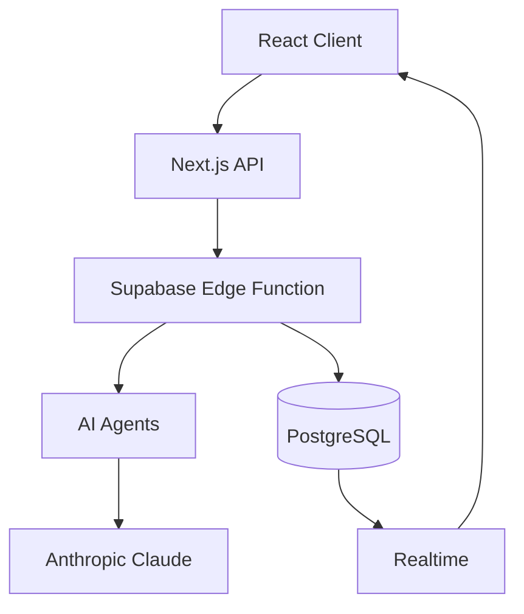

# GCCP - Generative Course Content Platform

[](./package.json)
[](https://nextjs.org/)
[](https://react.dev/)
[](https://www.typescriptlang.org/)
[](https://supabase.com/)

A production-ready platform for generating educational content using multi-agent AI architecture. Create lectures, pre-reads, and assignments with real-time progress tracking and intelligent content refinement.


---

## Features

### Core Capabilities

- **Multi-Agent AI Pipeline**: Sophisticated content generation using specialized AI agents
  - Course Detector: Identifies subject domain and context
  - Gap Analyzer: Analyzes transcript coverage
  - Content Creator: Generates initial drafts
  - Quality Reviewer: Evaluates and scores content
  - Refiner: Improves based on feedback
  - Critic Agent: Comprehensive quality assessment
  
- **Real-time Progress Tracking**: Watch your content generation progress from 0-100%
  - Granular stage-based progress
  - Live status messages
  - Streaming partial content
  - Resume interrupted generations

- **Multiple Content Modes**:
  - **Lecture**: Comprehensive lecture notes with examples
  - **Pre-read**: Background reading materials
  - **Assignment**: Auto-generated questions (MCQ, subjective)

- **PDF Export**: Professional PDF generation with syntax highlighting and math support

- **Gap Analysis**: Compare transcript coverage against requested topics

### Production Features

- **Authentication & Authorization**: Secure user management with Supabase Auth
- **Row Level Security**: Database-level access control
- **Real-time Updates**: Live progress via Supabase Realtime
- **Checkpoint System**: Resume failed generations from last checkpoint
- **Metrics & Analytics**: Track generation performance and quality scores
- **Rate Limiting**: Protect API endpoints from abuse

---

## Quick Start

### Prerequisites

- Node.js 20+ 
- npm or yarn
- Supabase account (free tier works)
- Anthropic API key

### Installation

1. **Clone the repository**
   ```bash
   git clone https://github.com/your-org/gccp.git
   cd gccp
   ```

2. **Install dependencies**
   ```bash
   npm install
   ```

3. **Set up environment variables**
   ```bash
   cp .env.example .env.local
   # Edit .env.local with your credentials
   ```

4. **Set up the database**
   ```bash
   # Via Supabase SQL Editor, run:
   # 1. supabase/migrations/20260127000000_initial_schema.sql
   # 2. supabase/migrations/20260130000000_production_enhancements.sql
   ```

5. **Run the development server**
   ```bash
   npm run dev
   ```

6. **Open [http://localhost:3000](http://localhost:3000)**

---

## Environment Setup

Create a `.env.local` file with the following variables:

```bash
# Supabase Configuration
NEXT_PUBLIC_SUPABASE_URL=https://your-project.supabase.co
NEXT_PUBLIC_SUPABASE_ANON_KEY=your-anon-key
SUPABASE_SERVICE_ROLE_KEY=your-service-role-key

# Anthropic AI
ANTHROPIC_API_KEY=sk-ant-api03-your-key

# Application
NEXT_PUBLIC_APP_URL=http://localhost:3000
NODE_ENV=development
```

See [`.env.example`](./.env.example) for the complete template.

---

## Testing

### Run All Tests

```bash
# Frontend tests
npm run test

# Backend/Edge Function tests
npm run test:backend

# Load tests
npm run test:load

# All tests
npm run test:all
```

### Test Coverage

```bash
npm run test:coverage
```

### Test Categories

| Test Type | Command | Description |
|-----------|---------|-------------|
| Unit | `npm run test` | Component and hook tests |
| Integration | `npm run test:backend` | Edge Function tests |
| Load | `npm run test:load` | k6 concurrent user tests |
| E2E | `npm run test:e2e` | Full user flow tests |

---

## Deployment

### Production Deployment

See the comprehensive [Production Deployment Guide](./docs/PRODUCTION_DEPLOYMENT.md) for detailed instructions.

Quick deployment steps:

```bash
# 1. Run database migrations
psql $DATABASE_URL -f supabase/migrations/20260127000000_initial_schema.sql
psql $DATABASE_URL -f supabase/migrations/20260130000000_production_enhancements.sql

# 2. Deploy Edge Function
supabase functions deploy generate-content

# 3. Build and deploy
npm run build
vercel --prod
```

### Environment Variables for Production

Ensure these are set in your production environment:

```bash
NEXT_PUBLIC_SUPABASE_URL=
NEXT_PUBLIC_SUPABASE_ANON_KEY=
SUPABASE_SERVICE_ROLE_KEY=
ANTHROPIC_API_KEY=
NEXT_PUBLIC_APP_URL=https://your-domain.com
NODE_ENV=production
```

---

## Architecture

### System Overview



### Agent Pipeline

1. **Course Detection** → Identifies subject domain
2. **Gap Analysis** → Analyzes transcript coverage (if provided)
3. **Draft Creation** → Generates initial content
4. **Sanitization** → Verifies against transcript
5. **Review & Refine** → Quality improvement loop
6. **Final Polish** → Professional formatting
7. **Critic Evaluation** → Comprehensive quality assessment

See [ARCHITECTURE.md](./docs/ARCHITECTURE.md) for detailed architecture documentation.

---

## API Documentation

### Endpoints

| Endpoint | Method | Description |
|----------|--------|-------------|
| `/api/generate` | POST | Start content generation |
| `/api/export/pdf` | POST | Export content as PDF |
| `/api/retry` | POST | Retry failed generation |
| `/api/stream` | POST | Stream AI responses |

See [API.md](./docs/API.md) for complete API documentation.

---

## Project Structure

```
GCCP/
├── src/
│   ├── app/                    # Next.js App Router
│   │   ├── api/               # API routes
│   │   ├── editor/            # Editor page
│   │   ├── archives/          # Archives page
│   │   └── login/             # Auth pages
│   ├── components/
│   │   ├── editor/            # Editor components
│   │   ├── ui/                # UI components
│   │   └── layout/            # Layout components
│   ├── hooks/                 # Custom React hooks
│   ├── lib/
│   │   ├── agents/            # AI agent implementations
│   │   ├── anthropic/         # Anthropic client
│   │   ├── exporters/         # Export utilities
│   │   ├── storage/           # Database utilities
│   │   └── supabase/          # Supabase clients
│   ├── prompts/               # AI prompts
│   └── types/                 # TypeScript types
├── supabase/
│   ├── functions/             # Edge Functions
│   │   └── generate-content/  # Main generation function
│   └── migrations/            # Database migrations
├── tests/                     # Test suites
└── docs/                      # Documentation
    ├── PRODUCTION_DEPLOYMENT.md
    ├── API.md
    ├── ARCHITECTURE.md
    └── MONITORING.md
```

---

## Configuration

### Stage Weights

Configure progress calculation weights in the `stage_weights` table:

| Stage | Weight | Description |
|-------|--------|-------------|
| Initialization | 2% | Setup and validation |
| Course Detection | 5% | Domain identification |
| Gap Analysis | 5% | Transcript coverage |
| Draft Creation | 40% | Content generation |
| Review | 15% | Quality review |
| Refinement | 20% | Content improvement |
| Formatting | 10% | Output formatting |
| Completion | 3% | Finalization |

### User Preferences

Users can customize their experience via the `user_preferences` table:

- Default content mode
- Auto-save settings
- Theme preferences
- Custom templates
- Generation settings

---

## Monitoring

See [MONITORING.md](./docs/MONITORING.md) for complete monitoring setup.

### Key Metrics

- Generation duration by mode
- Success/failure rates
- API response times
- Token usage and costs
- Quality scores distribution

### Alerts

Configure alerts for:

- Error rate > 1%
- Average generation time > 60s
- Database connection pool > 80%
- Anthropic API errors

---

## Troubleshooting

### Common Issues

#### Database Connection Failures
- Verify `DATABASE_URL` is correct
- Check IP allowlist in Supabase
- Ensure connection pool isn't exhausted

#### Edge Function Timeouts
- Check function logs in Supabase dashboard
- Verify `SUPABASE_SERVICE_ROLE_KEY` is set
- Check Anthropic API status

#### Real-time Updates Not Working
- Verify realtime is enabled on tables
- Check RLS policies allow SELECT
- Check browser console for WebSocket errors

See [PRODUCTION_DEPLOYMENT.md](./docs/PRODUCTION_DEPLOYMENT.md#troubleshooting) for more.

---

## Contributing

1. Fork the repository
2. Create a feature branch (`git checkout -b feature/amazing-feature`)
3. Commit your changes (`git commit -m 'Add amazing feature'`)
4. Push to the branch (`git push origin feature/amazing-feature`)
5. Open a Pull Request

### Development Guidelines

- Follow TypeScript strict mode
- Write tests for new features
- Update documentation
- Follow conventional commit messages

---

## License

[MIT](LICENSE) © 2026 GCCP Team

---

## Support

- **Documentation**: [docs/](./docs/)
- **Issues**: [GitHub Issues](https://github.com/your-org/gccp/issues)
- **Discussions**: [GitHub Discussions](https://github.com/your-org/gccp/discussions)

---

## Acknowledgments

- [Anthropic](https://anthropic.com) for Claude AI
- [Supabase](https://supabase.com) for backend infrastructure
- [Next.js](https://nextjs.org) for the React framework
- [Tailwind CSS](https://tailwindcss.com) for styling
