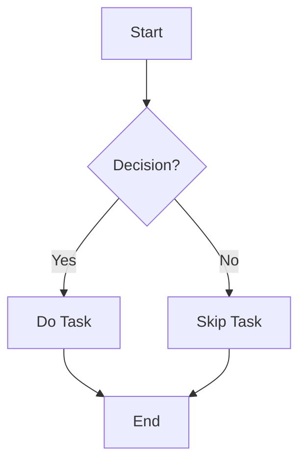
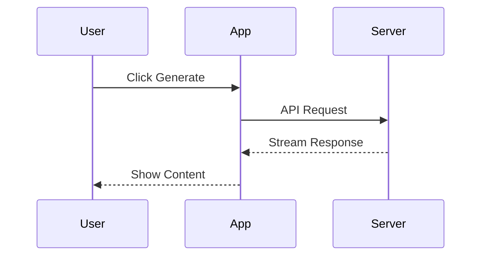
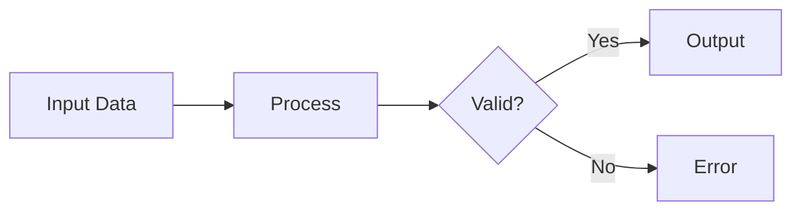
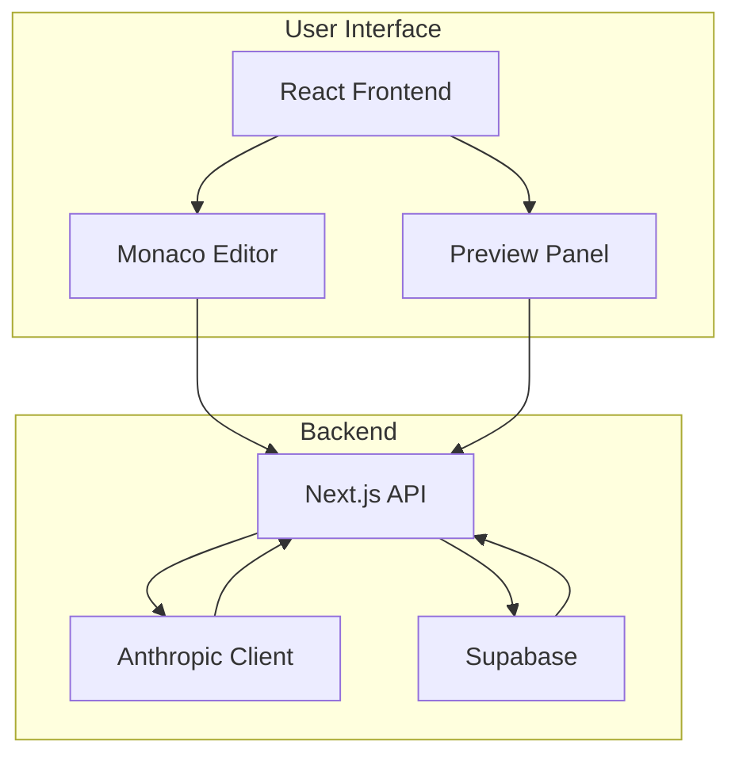

# 🧪 Testing Guide: Verify All Fixes

## Quick Start

```bash
cd /Users/rahul/Desktop/Expo/GCCP
npm run dev
```

Open: http://localhost:3000/editor

---

## Test 1: LaTeX Math Rendering ✓

### In Preview Panel:

**Test Content:**
```markdown
# Math Examples

Inline math: $E = mc^2$ and $x = \frac{-b \pm \sqrt{b^2-4ac}}{2a}$

Display math:
$$
\int_{-\infty}^{\infty} e^{-x^2} dx = \sqrt{\pi}
$$

$$
\nabla \times \vec{E} = -\frac{\partial \vec{B}}{\partial t}
$$
```

**Expected Result:**
- ✅ Inline equations render inline with text
- ✅ Display equations centered on their own lines
- ✅ Proper mathematical typesetting
- ✅ Superscripts, subscripts, fractions visible

**What to Check:**
1. Paste content into editor
2. Look at preview panel
3. Verify equations are rendered (not showing $...$)
4. Check proper formatting

---

## Test 2: PDF Export with LaTeX ✓

**Steps:**
1. Keep the math content in editor
2. Click "PDF" button
3. New window opens with print preview

**Expected Result:**
- ✅ All equations fully rendered in PDF preview
- ✅ Professional typesetting
- ✅ No raw LaTeX code visible
- ✅ Print button works
- ✅ Save as PDF produces good output

**What to Check:**
- Math looks identical to preview panel
- Equations are not blurry or pixelated
- Print preview shows "Save as PDF" option
- Saved PDF can be opened and looks professional

---

## Test 3: Mermaid Diagrams ✓

### Test Content:
```markdown
# Diagram Examples

## Flowchart


## Sequence Diagram

```

**Expected Result - Preview:**
- ✅ Flowchart appears as graphical diagram
- ✅ Sequence diagram shows participants and arrows
- ✅ Diagrams update after typing (debounced)
- ✅ No error messages during generation

**Expected Result - PDF:**
- ✅ Both diagrams render as SVG
- ✅ Clear, professional appearance
- ✅ Proper sizing and alignment
- ✅ No "loading" or error messages

**What to Check:**
1. Wait 1-2 seconds after pasting for diagrams to render
2. Verify both diagram types work
3. Check PDF export renders them correctly
4. Try modifying diagram code and see update

---

## Test 4: Syntax-Highlighted Code ✓

### Test Content:
```markdown
# Code Examples

## Python
```python
def fibonacci(n):
    """Calculate nth Fibonacci number"""
    if n <= 1:
        return n
    return fibonacci(n - 1) + fibonacci(n - 2)

# Usage
result = fibonacci(10)
print(f"Result: {result}")
```

## JavaScript
```javascript
const quickSort = (arr) => {
  if (arr.length <= 1) return arr;
  
  const pivot = arr[Math.floor(arr.length / 2)];
  const left = arr.filter(x => x < pivot);
  const equal = arr.filter(x => x === pivot);
  const right = arr.filter(x => x > pivot);
  
  return [...quickSort(left), ...equal, ...quickSort(right)];
};

console.log(quickSort([3, 6, 8, 10, 1]));
```
```

**Expected Result - Preview:**
- ✅ Python code: purple keywords, green strings, orange numbers
- ✅ JavaScript code: colored syntax
- ✅ Dark background for code blocks
- ✅ Light colored text on dark background
- ✅ Good contrast and readability

**Expected Result - PDF:**
- ✅ Same syntax coloring
- ✅ Dark backgrounds preserved
- ✅ Code doesn't break across pages (if possible)
- ✅ Monospace font clearly visible

**What to Check:**
- Keywords are colored (def, return, const, etc.)
- Strings are colored differently
- Comments are dimmed
- Background is dark
- Text is light colored and readable

---

## Test 5: HTML Elements ✓

### Test Content:
```markdown
# HTML Support

<div style="background-color: #e0f2fe; border-left: 4px solid #0284c7; padding: 16px; margin: 20px 0; border-radius: 8px;">
  <strong>💡 Information:</strong> This is an info box with custom styling!
</div>

<div style="background-color: #fef3c7; border-left: 4px solid #f59e0b; padding: 16px; margin: 20px 0; border-radius: 8px;">
  <strong>⚠️ Warning:</strong> Pay attention to this important note.
</div>

<details>
  <summary><strong>Click to expand</strong></summary>
  <p>Hidden content appears here!</p>
  <ul>
    <li>Item 1</li>
    <li>Item 2</li>
    <li>Item 3</li>
  </ul>
</details>

<div style="background: linear-gradient(135deg, #667eea 0%, #764ba2 100%); color: white; padding: 20px; border-radius: 12px; margin: 20px 0;">
  <h3 style="margin: 0 0 10px 0;">Gradient Box</h3>
  <p style="margin: 0;">This has a gradient background!</p>
</div>
```

**Expected Result - Preview:**
- ✅ Blue info box with left border
- ✅ Yellow warning box with left border
- ✅ Details/summary collapsible (click to expand)
- ✅ Gradient box with purple colors
- ✅ All styling preserved

**Expected Result - PDF:**
- ✅ All colored boxes visible
- ✅ Borders and backgrounds preserved
- ✅ Details/summary rendered (may be expanded)
- ✅ Gradient visible
- ✅ Text readable on colored backgrounds

**What to Check:**
- Background colors show correctly
- Borders are visible
- Padding/spacing looks good
- Text is readable
- Click details to expand/collapse (preview only)

---

## Test 6: Tables ✓

### Test Content:
```markdown
# Table Examples

| Feature | Status | Priority | Notes |
|---------|--------|----------|-------|
| LaTeX | ✅ Working | High | Math rendering |
| Mermaid | ✅ Working | High | Diagram support |
| Code | ✅ Working | Medium | Syntax highlighting |
| HTML | ✅ Working | Medium | Custom styling |
| Tables | ✅ Working | Low | This table! |

## Complex Table

| Syntax | Description | Example | Result |
|--------|-------------|---------|--------|
| `**bold**` | Bold text | `**Hello**` | **Hello** |
| `*italic*` | Italic text | `*Hello*` | *Hello* |
| `$x^2$` | Math | `$E=mc^2$` | $E=mc^2$ |
| `` `code` `` | Inline code | `` `print()` `` | `print()` |
```

**Expected Result - Preview:**
- ✅ Clean table borders
- ✅ Header row with different background
- ✅ Alternating row colors (optional)
- ✅ Good spacing in cells
- ✅ Inline formatting in cells works

**Expected Result - PDF:**
- ✅ Tables don't break mid-row
- ✅ Headers repeat if multi-page (optional)
- ✅ Borders are visible
- ✅ Spacing preserved
- ✅ Cell content aligned properly

**What to Check:**
- Table headers stand out
- Borders are visible
- Content in cells renders correctly
- No overlapping text
- Readable font size

---

## Test 7: Mixed Content ✓

### Test Content:
```markdown
# Complete Feature Test

This document tests **everything at once**!

## Section 1: Math in Context

The quadratic formula $x = \frac{-b \pm \sqrt{b^2-4ac}}{2a}$ can be derived from completing the square.

Display form:
$$
ax^2 + bx + c = 0 \implies x = \frac{-b \pm \sqrt{b^2-4ac}}{2a}
$$

## Section 2: Code Example

```python
import numpy as np

def calculate_mean(data):
    """Calculate arithmetic mean"""
    return np.sum(data) / len(data)

# Example usage
numbers = [1, 2, 3, 4, 5]
mean = calculate_mean(numbers)
print(f"Mean: {mean}")  # Output: Mean: 3.0
```

## Section 3: Diagram



## Section 4: Special Note

<div style="background-color: #dcfce7; border: 2px solid #22c55e; padding: 16px; border-radius: 8px; margin: 20px 0;">
  <strong>✅ Success:</strong> All features working together!
</div>

## Section 5: Summary Table

| Component | Status | Notes |
|-----------|--------|-------|
| Math | ✅ | KaTeX v0.16.27 |
| Diagrams | ✅ | Mermaid v11 |
| Code | ✅ | Highlight.js |
| HTML | ✅ | Full support |
```

**Expected Result:**
- ✅ All features work simultaneously
- ✅ No conflicts between features
- ✅ Proper spacing throughout
- ✅ Professional appearance
- ✅ PDF matches preview

**What to Check:**
1. Everything renders in preview
2. No error messages
3. Click PDF button
4. Verify all elements in print preview
5. Save PDF and open it
6. Compare PDF to preview - should match

---

## Test 8: Assignment Mode ✓

**Steps:**
1. Switch to "assignment" mode in editor
2. Set question counts (e.g., 5 MCSC, 3 MCMC, 2 Subjective)
3. Enter topic: "Calculus - Derivatives"
4. Enter subtopics:
   ```
   Power Rule
   Product Rule
   Chain Rule
   ```
5. Click "Generate"

**Wait for Generation to Complete**

**Expected Result:**
- ✅ Questions include LaTeX formulas
- ✅ Table view shows rendered math
- ✅ Student view shows rendered math
- ✅ Reference view formatted correctly
- ✅ PDF export works with all formatting

**What to Check in Student View:**
- Math equations properly rendered
- Clear question numbering
- Options clearly displayed
- Answer key section styled differently
- Explanations readable

**What to Check in PDF:**
- All questions visible
- Math formulas rendered
- Professional layout
- Page breaks sensible
- No content cut off

---

## Test 9: Lecture/Pre-read Mode ✓

**Steps:**
1. Switch to "lecture" or "pre-read" mode
2. Enter topic: "Introduction to Machine Learning"
3. Enter subtopics:
   ```
   Supervised Learning
   Neural Networks
   Activation Functions
   ```
4. Click "Generate"

**Wait for Generation**

**Expected Result:**
- ✅ Content streams into editor
- ✅ Preview updates in real-time
- ✅ All markdown features work
- ✅ LaTeX, code, diagrams render
- ✅ PDF export produces quality document

**What to Check:**
- Content is readable while generating
- No lag in editor
- Preview shows formatted content
- PDF button enabled after generation
- PDF output is professional

---

## Test 10: Edge Cases ✓

### Test 10a: Very Long Document

**Create content with:**
- 20+ headings
- 50+ paragraphs
- 10+ code blocks
- 5+ Mermaid diagrams
- Multiple tables

**Expected:**
- ✅ Preview handles it smoothly
- ✅ No performance issues
- ✅ PDF generates successfully
- ✅ Page breaks are reasonable

### Test 10b: Complex Math

```markdown
$$
\begin{aligned}
\nabla \times \vec{E} &= -\frac{\partial \vec{B}}{\partial t} \\
\nabla \times \vec{B} &= \mu_0\vec{J} + \mu_0\epsilon_0\frac{\partial \vec{E}}{\partial t} \\
\nabla \cdot \vec{E} &= \frac{\rho}{\epsilon_0} \\
\nabla \cdot \vec{B} &= 0
\end{aligned}
$$
```

**Expected:**
- ✅ Aligned equations render correctly
- ✅ All symbols visible
- ✅ Proper spacing
- ✅ PDF preserves alignment

### Test 10c: Complex Mermaid



**Expected:**
- ✅ Subgraphs render correctly
- ✅ All connections visible
- ✅ Readable labels
- ✅ Good sizing

---

## Automated Test Checklist

### Run Through This List:

#### Preview Panel:
- [ ] LaTeX inline renders
- [ ] LaTeX display renders
- [ ] Mermaid diagrams appear (wait 1-2s)
- [ ] Code blocks have syntax colors
- [ ] HTML elements styled correctly
- [ ] Tables have borders
- [ ] Blockquotes have colored borders
- [ ] Lists have proper spacing
- [ ] Links are clickable and colored
- [ ] Images load (if URLs present)

#### PDF Export:
- [ ] Click PDF button opens new window
- [ ] Print preview appears
- [ ] All LaTeX rendered
- [ ] All Mermaid diagrams visible
- [ ] Code blocks colored
- [ ] HTML elements styled
- [ ] Tables formatted
- [ ] "Save as PDF" option works
- [ ] Saved PDF can be opened
- [ ] PDF looks professional

#### Performance:
- [ ] No lag while typing
- [ ] Preview updates smoothly
- [ ] PDF generates in 1-3 seconds
- [ ] No console errors
- [ ] No visual glitches

#### Content Modes:
- [ ] Lecture mode works
- [ ] Pre-read mode works
- [ ] Assignment mode works
- [ ] CSV export works (assignment)
- [ ] All PDF exports work

---

## Troubleshooting

### Issue: LaTeX Not Rendering in Preview
**Check:**
1. Is KaTeX CSS loaded? (Check globals.css)
2. Are $ delimiters correct? (not escaped)
3. Check browser console for errors

**Fix:**
- Refresh page
- Clear browser cache
- Check LaTeX syntax

### Issue: Mermaid Diagram Not Showing
**Check:**
1. Wait 1-2 seconds (debounced rendering)
2. Check Mermaid syntax
3. Look for error in browser console

**Fix:**
- Simplify diagram
- Check Mermaid documentation
- Try basic flowchart first

### Issue: PDF Window Blocked
**Check:**
1. Browser showing popup blocked icon?
2. Allow popups for localhost

**Fix:**
- Click "Allow" in browser address bar
- Check browser settings
- Try different browser

### Issue: PDF Not Rendering Features
**Check:**
1. Did print preview load fully?
2. Wait 2-3 seconds before printing
3. Check browser console in PDF window

**Fix:**
- Refresh PDF window
- Try simpler content first
- Update browser

---

## Success Criteria

### ✅ All Tests Pass When:

1. **Preview Panel:**
   - All markdown features render correctly
   - No raw LaTeX or Mermaid code visible
   - Styling matches expectations
   - No performance issues

2. **PDF Export:**
   - Print preview shows formatted content
   - Math, diagrams, code all rendered
   - Professional appearance
   - Can save/print successfully

3. **All Modes:**
   - Lecture/pre-read PDFs format correctly
   - Assignment PDFs include rendered math
   - CSV export works
   - No errors in console

4. **Build:**
   - `npm run build` succeeds
   - No TypeScript errors
   - No compilation warnings

---

## Final Verification

Run this command:
```bash
cd /Users/rahul/Desktop/Expo/GCCP
npm run build
```

**Expected output:**
```
✓ Compiled successfully
✓ Collecting page data
✓ Generating static pages
✓ Finalizing page optimization

Build completed successfully!
```

If build succeeds and all manual tests pass:
## ✅ ALL FIXES VERIFIED AND WORKING!

---

**Testing Date:** January 31, 2026
**Status:** ✅ READY FOR USE
**Next Step:** 🚀 Use in production!
