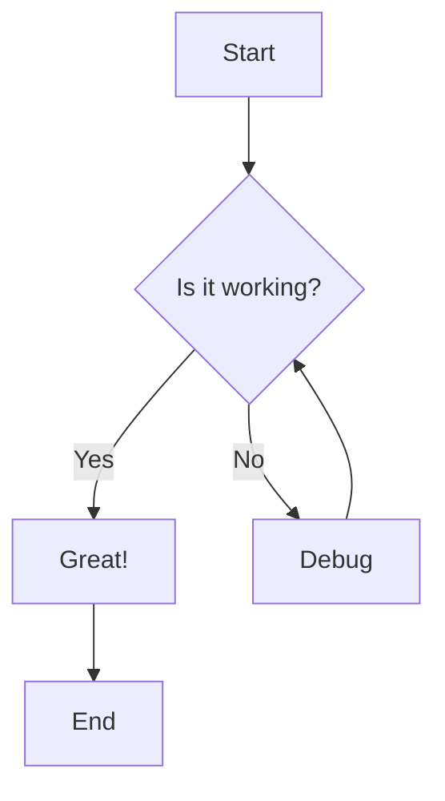

# Test Markdown Rendering

This file tests all advanced markdown features that should now work in both preview and PDF export.

## LaTeX Math Support

### Inline Math
The quadratic formula is $x = \frac{-b \pm \sqrt{b^2-4ac}}{2a}$.

Einstein's famous equation: $E = mc^2$

### Display Math
$$
\int_{-\infty}^{\infty} e^{-x^2} dx = \sqrt{\pi}
$$

$$
\nabla \times \vec{E} = -\frac{\partial \vec{B}}{\partial t}
$$

## Code Blocks with Syntax Highlighting

### JavaScript
```javascript
function fibonacci(n) {
  if (n <= 1) return n;
  return fibonacci(n - 1) + fibonacci(n - 2);
}

console.log(fibonacci(10)); // 55
```

### Python
```python
def quicksort(arr):
    if len(arr) <= 1:
        return arr
    pivot = arr[len(arr) // 2]
    left = [x for x in arr if x < pivot]
    middle = [x for x in arr if x == pivot]
    right = [x for x in arr if x > pivot]
    return quicksort(left) + middle + quicksort(right)

print(quicksort([3, 6, 8, 10, 1, 2, 1]))
```

## Mermaid Diagrams

### Flowchart


### Sequence Diagram


## HTML Elements

<div style="background-color: #e0f2fe; border-left: 4px solid #0284c7; padding: 16px; margin: 20px 0; border-radius: 8px;">
  <strong>💡 Pro Tip:</strong> HTML elements with inline styles should now render correctly in both preview and PDF!
</div>

<details>
  <summary><strong>Click to expand: Hidden Content</strong></summary>
  <p>This content is hidden until you click the summary!</p>
  <ul>
    <li>Feature 1: Works in preview</li>
    <li>Feature 2: Works in PDF export</li>
    <li>Feature 3: Properly styled</li>
  </ul>
</details>

## Tables

| Feature | Preview | PDF Export | Status |
|---------|---------|------------|--------|
| LaTeX Math | ✅ | ✅ | Working |
| Mermaid | ✅ | ✅ | Working |
| HTML | ✅ | ✅ | Working |
| Code Highlighting | ✅ | ✅ | Working |
| Tables | ✅ | ✅ | Working |

## Advanced Formatting

**Bold text** and *italic text* and ***bold italic text***.

~~Strikethrough text~~

Inline `code` with syntax highlighting.

> This is a blockquote.
> It can span multiple lines.
> 
> And even have multiple paragraphs.

## Lists

### Unordered List
- Item 1
- Item 2
  - Nested item 2.1
  - Nested item 2.2
- Item 3

### Ordered List
1. First step
2. Second step
   1. Sub-step 2.1
   2. Sub-step 2.2
3. Third step

### Task List
- [x] Completed task
- [ ] Pending task
- [ ] Another pending task

## Links and Images

[Visit GitHub](https://github.com)

External link test: [Google](https://google.com)

---

## Testing Notes

### What was fixed:
1. **PDF Export now supports:**
   - ✅ LaTeX/KaTeX math equations (inline and display)
   - ✅ Mermaid diagrams (rendered as SVG)
   - ✅ Syntax-highlighted code blocks
   - ✅ HTML elements with inline styles
   - ✅ Tables, lists, blockquotes
   - ✅ Details/summary collapsible sections

2. **Preview panel now shows:**
   - ✅ Enhanced typography matching PDF output
   - ✅ Better spacing and readability
   - ✅ Proper rendering of all markdown features
   - ✅ HTML elements without sanitization issues

3. **All content modes supported:**
   - ✅ Lecture notes
   - ✅ Pre-read materials
   - ✅ Assignment questions (with special viewer)


## Pre-Read: Mathematics

### What You'll Discover

- Why some differential equations produce solutions that oscillate while decaying—and how to predict this behavior
- How complex numbers emerge naturally when solving real-world problems (and why that's not just mathematical trickery)
- The surprising connection between exponential functions and circular motion
- How to read the "personality" of a differential equation from its characteristic roots

### When Reality Gets Complex

<div style="background: linear-gradient(135deg, #faf5ff 0%, #f3e8ff 100%); border-radius: 16px; padding: 24px 28px; margin: 24px 0; border: 1px solid #e9d5ff;">
  <div style="font-size: 1.2em; font-weight: 600; color: #7c3aed; margin-bottom: 12px;">🌊 The Oscillation Puzzle</div>
  <p style="color: #6b21a8; margin: 0; line-height: 1.8; font-size: 1.05em;">Picture a guitar string after you pluck it. It vibrates back and forth, but the amplitude gradually decreases until it comes to rest. Or consider a car's shock absorber after hitting a bump—it oscillates a few times before settling down. These physical systems don't just decay exponentially, and they don't oscillate forever. They do something in between: they oscillate while decaying. How do we capture this behavior mathematically?</p>
</div>

When you try to solve the differential equation that models these systems, something unexpected happens. The characteristic equation gives you roots that aren't real numbers—they involve the square root of negative numbers. Your first instinct might be to think you've made an error. But nature is telling you something profound: the solution must combine two fundamentally different behaviors (oscillation and decay), and complex numbers are the language for describing exactly that combination.

### Understanding Complex Roots

<div style="background-color: #f8fafc; border: 1px solid #e2e8f0; border-radius: 12px; padding: 20px 24px; margin: 24px 0;">
  <div style="font-weight: 600; color: #334155; margin-bottom: 12px; font-size: 1.1em;">🎯 What Are Complex Roots?</div>
  <p style="color: #64748b; margin: 0; line-height: 1.7;">Think of tuning a radio. You have two knobs: one controls the station frequency (which determines what you hear), and another controls the volume (which determines how loud it is). Complex roots work similarly—they have two independent pieces of information. The real part acts like the volume knob, controlling whether solutions grow or decay. The imaginary part acts like the frequency dial, controlling how fast solutions oscillate.</p>
</div>

When you solve a second-order linear differential equation with constant coefficients, you form the **characteristic equation**—essentially treating the equation as if solutions have the form $y = e^{rx}$. The values of $r$ that work are called the characteristic roots.

Sometimes these roots come in the form $r = \alpha \pm \beta i$, where $i = \sqrt{-1}$. The real part is denoted $\alpha$ (alpha), and the imaginary part is denoted $\beta$ (beta). These always appear as **conjugate pairs**—if $\alpha + \beta i$ is a root, then $\alpha - \beta i$ must also be a root.

<div style="background-color: #ecfdf5; border-radius: 12px; padding: 20px 24px; margin: 24px 0;">
  <div style="font-weight: 600; color: #047857; margin-bottom: 16px;">✨ Why Complex Roots Matter</div>
  <ul style="list-style: none; padding: 0; margin: 0;">
    <li style="padding: 10px 0 10px 28px; position: relative; color: #065f46; line-height: 1.6;"><span style="position: absolute; left: 0;">✓</span> They predict oscillatory behavior in physical systems—from pendulums to electrical circuits to structural vibrations</li>
    <li style="padding: 10px 0 10px 28px; position: relative; color: #065f46; line-height: 1.6;"><span style="position: absolute; left: 0;">✓</span> The real part tells you whether the system is stable (decaying), unstable (growing), or neutrally stable (constant amplitude)</li>
    <li style="padding: 10px 0 10px 28px; position: relative; color: #065f46; line-height: 1.6;"><span style="position: absolute; left: 0;">✓</span> The imaginary part determines the frequency of oscillation—crucial for designing systems that vibrate at specific rates</li>
    <li style="padding: 10px 0 10px 28px; position: relative; color: #065f46; line-height: 1.6;"><span style="position: absolute; left: 0;">✓</span> They appear everywhere in engineering: control systems stability, signal processing, quantum mechanics, and structural analysis</li>
  </ul>
</div>

### From Simple Exponentials to Oscillating Solutions

<div style="display: flex; gap: 16px; margin: 24px 0; flex-wrap: wrap;">
  <div style="flex: 1; min-width: 250px; background-color: #fef2f2; border-radius: 12px; padding: 16px 20px;">
    <div style="font-weight: 600; color: #dc2626; margin-bottom: 10px;">📉 Real Roots Only</div>
    <p style="color: #991b1b; margin: 0; line-height: 1.6; font-size: 0.95em;">When characteristic roots are real numbers, solutions are purely exponential: they either grow, decay, or remain constant. No oscillation occurs. Think of a ball rolling down a hill—it just accelerates in one direction without any back-and-forth motion.</p>
  </div>
  <div style="flex: 1; min-width: 250px; background-color: #f0fdf4; border-radius: 12px; padding: 16px 20px;">
    <div style="font-weight: 600; color: #16a34a; margin-bottom: 10px;">🌀 Complex Roots</div>
    <p style="color: #166534; margin: 0; line-height: 1.6; font-size: 0.95em;">When roots are complex, solutions combine exponential behavior with sinusoidal oscillation. You get functions like exponentially decaying sine waves. Think of that guitar string again—oscillating back and forth while the amplitude gradually dies down.</p>
  </div>
</div>

The crucial connection: when you have complex roots $r = \alpha \pm \beta i$, the general solution takes the form:

$y(x) = e^{\alpha x}(C_1 \cos(\beta x) + C_2 \sin(\beta x))$

Notice how this breaks into two parts:

- The exponential envelope $e^{\alpha x}$ (controlled by the real part $\alpha$)
- The oscillating interior $C_1 \cos(\beta x) + C_2 \sin(\beta x)$ (controlled by the imaginary part $\beta$)

<div style="background-color: #e0f2fe; border-left: 4px solid #0ea5e9; padding: 16px 20px; margin: 20px 0; border-radius: 0 8px 8px 0;">
  <div style="font-weight: 600; color: #0284c7; margin-bottom: 8px;">💡 Quick Insight</div>
  <p style="color: #0369a1; margin: 0; line-height: 1.6;">If the real part is negative, the exponential envelope decays toward zero—creating damped oscillations. If it's positive, the oscillations grow in amplitude—creating instability. If it's exactly zero, you get pure oscillation with constant amplitude, like an ideal frictionless pendulum.</p>
</div>

### Decoding the Characteristic Equation

<div style="background-color: #f8fafc; border: 1px solid #e2e8f0; border-radius: 12px; padding: 20px 24px; margin: 24px 0;">
  <div style="font-weight: 600; color: #334155; margin-bottom: 12px; font-size: 1.1em;">🔍 The Root-Finding Process</div>
  <p style="color: #64748b; margin: 0; line-height: 1.7;">Consider a second-order differential equation with constant coefficients. To find its characteristic roots, you substitute the trial solution and get a quadratic equation. The discriminant of this quadratic determines what type of roots you'll encounter.</p>
</div>

For a characteristic equation $ar^2 + br + c = 0$, the discriminant is $b^2 - 4ac$. This discriminant reveals everything about solution behavior:

**When the discriminant is positive**: You get two distinct real roots. Solutions are combinations of exponentials.

**When the discriminant is zero**: You get one repeated real root. Solutions involve both $e^{rx}$ and $xe^{rx}$.

**When the discriminant is negative**: You get complex conjugate roots. Solutions oscillate while growing or decaying exponentially.

The discriminant being negative isn't a problem—it's nature's way of signaling that oscillation is part of the solution's character.

### A Complete Example: From Equation to Solution

Let's work through a concrete case to see how these ideas connect.

**Given differential equation**: $y'' + 4y' + 13y = 0$

**Step 1: Form the characteristic equation**

Substitute $y = e^{rx}$ to get: $r^2 + 4r + 13 = 0$

**Step 2: Calculate the discriminant**

$b^2 - 4ac = 16 - 4(1)(13) = 16 - 52 = -36$

The negative discriminant confirms we'll have complex roots with oscillatory behavior.

**Step 3: Apply the quadratic formula**

$r = \frac{-4 \pm \sqrt{-36}}{2} = \frac{-4 \pm 6i}{2} = -2 \pm 3i$

**Step 4: Identify the components**

Real part: $\alpha = -2$ (negative, so solutions decay)

Imaginary part: $\beta = 3$ (determines oscillation frequency)

**Step 5: Write the general solution**

$y(x) = e^{-2x}(C_1\cos(3x) + C_2\sin(3x))$

This solution oscillates with angular frequency 3 while decaying exponentially with rate 2. The constants $C_1$ and $C_2$ would be determined by initial conditions.

<div style="background-color: #fef7e6; border-left: 4px solid #f5a623; padding: 16px 20px; margin: 20px 0; border-radius: 0 8px 8px 0;">
  <div style="font-weight: 600; color: #b8860b; margin-bottom: 8px;">❓ Question to Ponder</div>
  <p style="color: #92702b; margin: 0; line-height: 1.6;">Why do complex roots always come in conjugate pairs for differential equations with real coefficients? What would go wrong if you had just one complex root without its conjugate partner?</p>
</div>

### The Power of Complex Exponentials

<div style="background-color: #f8fafc; border: 1px solid #e2e8f0; border-radius: 12px; padding: 20px 24px; margin: 24px 0;">
  <div style="font-weight: 600; color: #334155; margin-bottom: 12px; font-size: 1.1em;">🎭 Euler's Formula: The Hidden Connection</div>
  <p style="color: #64748b; margin: 0; line-height: 1.7;">There's a remarkable formula that connects exponentials to trigonometry, discovered by Leonhard Euler. It states that for any real number, the exponential of an imaginary number can be written in terms of sine and cosine. This isn't just mathematical sleight of hand—it reveals a deep connection between rotation and exponential growth.</p>
</div>

You might wonder how we get from complex exponentials like $e^{(\alpha + \beta i)x}$ to the sine and cosine form we claimed earlier. The bridge is one of mathematics' most beautiful formulas.

The formula is:

$e^{i\theta} = \cos(\theta) + i\sin(\theta)$

This means that when you write $e^{(\alpha + \beta i)x}$, you can split it as:

$e^{(\alpha + \beta i)x} = e^{\alpha x} \cdot e^{i\beta x} = e^{\alpha x}(\cos(\beta x) + i\sin(\beta x))$

The exponential part $e^{\alpha x}$ handles growth or decay, while $e^{i\beta x}$ handles rotation in the complex plane—which manifests as oscillation in the real solution.

<details style="margin: 20px 0; border: 1px solid #e9d5ff; border-radius: 8px; overflow: hidden; background: #faf5ff;">
  <summary style="padding: 16px 20px; cursor: pointer; font-weight: 600; color: #7c3aed;">🤔 Think about it: Why does rotation in the complex plane become oscillation?</summary>
  <div style="padding: 16px 20px; background: #ffffff; border-top: 1px solid #e9d5ff; color: #6b21a8; line-height: 1.7;">
    Imagine a point moving in a circle in the complex plane. As it rotates, its horizontal position (the real part) traces out a cosine wave, while its vertical position (the imaginary part) traces out a sine wave. When we take only the real part of a complex exponential solution, we're essentially projecting that circular motion onto the real axis—which gives us the oscillatory behavior we see in physical systems.
  </div>
</details>

### Reading the Solution's Behavior from the Roots

Once you know the characteristic roots, you can predict qualitatively what solutions will look like before doing any calculations. This is incredibly powerful for understanding system behavior.

<div style="background-color: #f8fafc; border: 1px solid #e2e8f0; border-radius: 12px; padding: 20px 24px; margin: 24px 0;">
  <div style="font-weight: 600; color: #334155; margin-bottom: 12px; font-size: 1.1em;">📊 Root Location Guide</div>
  <p style="color: #64748b; margin: 0; line-height: 1.7; margin-bottom: 12px;">Think of the complex plane as a map where the horizontal axis represents the real part and the vertical axis represents the imaginary part. Where your roots land on this map tells you everything about solution behavior.</p>
  <p style="color: #64748b; margin: 0; line-height: 1.7;"><strong>Left half-plane (negative real part):</strong> Solutions decay to zero—stable system</p>
  <p style="color: #64748b; margin: 0; line-height: 1.7;"><strong>Right half-plane (positive real part):</strong> Solutions grow without bound—unstable system</p>
  <p style="color: #64748b; margin: 0; line-height: 1.7;"><strong>Imaginary axis (zero real part):</strong> Solutions oscillate with constant amplitude—neutrally stable</p>
  <p style="color: #64748b; margin: 0; line-height: 1.7; margin-top: 12px;"><strong>Distance from real axis:</strong> Determines oscillation frequency—farther away means faster oscillation</p>
</div>

For example, if you're designing a suspension system for a car, you want roots in the left half-plane (so vibrations die out) but not too far left (or the ride becomes stiff). The imaginary part determines how many times the car bounces before settling. Roots at $r = -0.5 \pm 3i$ would give slow decay with rapid oscillation—a bouncy ride. Roots at $r = -2 \pm i$ would give fast decay with slow oscillation—a stiff but stable ride.

<div style="background-color: #f3e8ff; border-left: 4px solid #a855f7; padding: 16px 20px; margin: 20px 0; border-radius: 0 8px 8px 0;">
  <div style="font-weight: 600; color: #7c3aed; margin-bottom: 8px;">🔮 Sneak Preview</div>
  <p style="color: #6d28d9; margin: 0; line-height: 1.6;">In the upcoming lecture, you'll see how to systematically find these complex roots, construct the general solution, and apply initial conditions to solve specific problems. You'll work through examples from mechanical vibrations and electrical circuits, seeing how the same mathematical framework applies across different physical systems.</p>
</div>

### Thinking Ahead

<details style="margin: 20px 0; border: 1px solid #e9d5ff; border-radius: 8px; overflow: hidden; background: #faf5ff;">
  <summary style="padding: 16px 20px; cursor: pointer; font-weight: 600; color: #7c3aed;">🤔 How do initial conditions affect oscillatory solutions?</summary>
  <div style="padding: 16px 20px; background: #ffffff; border-top: 1px solid #e9d5ff; color: #6b21a8; line-height: 1.7;">
    Complex roots give you a general solution with two arbitrary constants. Initial conditions (like starting position and velocity) determine these constants. But here's an interesting question: can initial conditions change whether the system oscillates? Or is that behavior locked in by the characteristic roots themselves?
  </div>
</details>

<details style="margin: 20px 0; border: 1px solid #e9d5ff; border-radius: 8px; overflow: hidden; background: #faf5ff;">
  <summary style="padding: 16px 20px; cursor: pointer; font-weight: 600; color: #7c3aed;">🤔 What happens at the boundary between real and complex roots?</summary>
  <div style="padding: 16px 20px; background: #ffffff; border-top: 1px solid #e9d5ff; color: #6b21a8; line-height: 1.7;">
    When the discriminant equals zero, you're right at the transition point between real and complex roots. This is called critical damping in physical systems. Why is this case special? What makes it different from both oscillatory solutions and purely exponential ones?
  </div>
</details>

<div style="background-color: #fef7e6; border-left: 4px solid #f5a623; padding: 16px 20px; margin: 20px 0; border-radius: 0 8px 8px 0;">
  <div style="font-weight: 600; color: #b8860b; margin-bottom: 8px;">❓ Question to Ponder</div>
  <p style="color: #92702b; margin: 0; line-height: 1.6;">If you're analyzing a mechanical system and find that the characteristic roots have a positive real part, what does this tell you about the system's long-term behavior? Would you want to build something with these characteristics?</p>
</div>## Pre-Read: Mathematics

### What You'll Discover

- Why some differential equations produce solutions that oscillate while decaying—and how to predict this behavior
- How complex numbers emerge naturally when solving real-world problems (and why that's not just mathematical trickery)
- The surprising connection between exponential functions and circular motion
- How to read the "personality" of a differential equation from its characteristic roots

### When Reality Gets Complex

<div style="background: linear-gradient(135deg, #faf5ff 0%, #f3e8ff 100%); border-radius: 16px; padding: 24px 28px; margin: 24px 0; border: 1px solid #e9d5ff;">
  <div style="font-size: 1.2em; font-weight: 600; color: #7c3aed; margin-bottom: 12px;">🌊 The Oscillation Puzzle</div>
  <p style="color: #6b21a8; margin: 0; line-height: 1.8; font-size: 1.05em;">Picture a guitar string after you pluck it. It vibrates back and forth, but the amplitude gradually decreases until it comes to rest. Or consider a car's shock absorber after hitting a bump—it oscillates a few times before settling down. These physical systems don't just decay exponentially, and they don't oscillate forever. They do something in between: they oscillate while decaying. How do we capture this behavior mathematically?</p>
</div>

When you try to solve the differential equation that models these systems, something unexpected happens. The characteristic equation gives you roots that aren't real numbers—they involve the square root of negative numbers. Your first instinct might be to think you've made an error. But nature is telling you something profound: the solution must combine two fundamentally different behaviors (oscillation and decay), and complex numbers are the language for describing exactly that combination.

### Understanding Complex Roots

<div style="background-color: #f8fafc; border: 1px solid #e2e8f0; border-radius: 12px; padding: 20px 24px; margin: 24px 0;">
  <div style="font-weight: 600; color: #334155; margin-bottom: 12px; font-size: 1.1em;">🎯 What Are Complex Roots?</div>
  <p style="color: #64748b; margin: 0; line-height: 1.7;">Think of tuning a radio. You have two knobs: one controls the station frequency (which determines what you hear), and another controls the volume (which determines how loud it is). Complex roots work similarly—they have two independent pieces of information. The real part acts like the volume knob, controlling whether solutions grow or decay. The imaginary part acts like the frequency dial, controlling how fast solutions oscillate.</p>
</div>

When you solve a second-order linear differential equation with constant coefficients, you form the **characteristic equation**—essentially treating the equation as if solutions have the form $y = e^{rx}$. The values of $r$ that work are called the characteristic roots.

Sometimes these roots come in the form $r = \alpha \pm \beta i$, where $i = \sqrt{-1}$. The real part is denoted $\alpha$ (alpha), and the imaginary part is denoted $\beta$ (beta). These always appear as **conjugate pairs**—if $\alpha + \beta i$ is a root, then $\alpha - \beta i$ must also be a root.

<div style="background-color: #ecfdf5; border-radius: 12px; padding: 20px 24px; margin: 24px 0;">
  <div style="font-weight: 600; color: #047857; margin-bottom: 16px;">✨ Why Complex Roots Matter</div>
  <ul style="list-style: none; padding: 0; margin: 0;">
    <li style="padding: 10px 0 10px 28px; position: relative; color: #065f46; line-height: 1.6;"><span style="position: absolute; left: 0;">✓</span> They predict oscillatory behavior in physical systems—from pendulums to electrical circuits to structural vibrations</li>
    <li style="padding: 10px 0 10px 28px; position: relative; color: #065f46; line-height: 1.6;"><span style="position: absolute; left: 0;">✓</span> The real part tells you whether the system is stable (decaying), unstable (growing), or neutrally stable (constant amplitude)</li>
    <li style="padding: 10px 0 10px 28px; position: relative; color: #065f46; line-height: 1.6;"><span style="position: absolute; left: 0;">✓</span> The imaginary part determines the frequency of oscillation—crucial for designing systems that vibrate at specific rates</li>
    <li style="padding: 10px 0 10px 28px; position: relative; color: #065f46; line-height: 1.6;"><span style="position: absolute; left: 0;">✓</span> They appear everywhere in engineering: control systems stability, signal processing, quantum mechanics, and structural analysis</li>
  </ul>
</div>

### From Simple Exponentials to Oscillating Solutions

<div style="display: flex; gap: 16px; margin: 24px 0; flex-wrap: wrap;">
  <div style="flex: 1; min-width: 250px; background-color: #fef2f2; border-radius: 12px; padding: 16px 20px;">
    <div style="font-weight: 600; color: #dc2626; margin-bottom: 10px;">📉 Real Roots Only</div>
    <p style="color: #991b1b; margin: 0; line-height: 1.6; font-size: 0.95em;">When characteristic roots are real numbers, solutions are purely exponential: they either grow, decay, or remain constant. No oscillation occurs. Think of a ball rolling down a hill—it just accelerates in one direction without any back-and-forth motion.</p>
  </div>
  <div style="flex: 1; min-width: 250px; background-color: #f0fdf4; border-radius: 12px; padding: 16px 20px;">
    <div style="font-weight: 600; color: #16a34a; margin-bottom: 10px;">🌀 Complex Roots</div>
    <p style="color: #166534; margin: 0; line-height: 1.6; font-size: 0.95em;">When roots are complex, solutions combine exponential behavior with sinusoidal oscillation. You get functions like exponentially decaying sine waves. Think of that guitar string again—oscillating back and forth while the amplitude gradually dies down.</p>
  </div>
</div>

The crucial connection: when you have complex roots $r = \alpha \pm \beta i$, the general solution takes the form:

$y(x) = e^{\alpha x}(C_1 \cos(\beta x) + C_2 \sin(\beta x))$

Notice how this breaks into two parts:

- The exponential envelope $e^{\alpha x}$ (controlled by the real part $\alpha$)
- The oscillating interior $C_1 \cos(\beta x) + C_2 \sin(\beta x)$ (controlled by the imaginary part $\beta$)

<div style="background-color: #e0f2fe; border-left: 4px solid #0ea5e9; padding: 16px 20px; margin: 20px 0; border-radius: 0 8px 8px 0;">
  <div style="font-weight: 600; color: #0284c7; margin-bottom: 8px;">💡 Quick Insight</div>
  <p style="color: #0369a1; margin: 0; line-height: 1.6;">If the real part is negative, the exponential envelope decays toward zero—creating damped oscillations. If it's positive, the oscillations grow in amplitude—creating instability. If it's exactly zero, you get pure oscillation with constant amplitude, like an ideal frictionless pendulum.</p>
</div>

### Decoding the Characteristic Equation

<div style="background-color: #f8fafc; border: 1px solid #e2e8f0; border-radius: 12px; padding: 20px 24px; margin: 24px 0;">
  <div style="font-weight: 600; color: #334155; margin-bottom: 12px; font-size: 1.1em;">🔍 The Root-Finding Process</div>
  <p style="color: #64748b; margin: 0; line-height: 1.7;">Consider a second-order differential equation with constant coefficients. To find its characteristic roots, you substitute the trial solution and get a quadratic equation. The discriminant of this quadratic determines what type of roots you'll encounter.</p>
</div>

For a characteristic equation $ar^2 + br + c = 0$, the discriminant is $b^2 - 4ac$. This discriminant reveals everything about solution behavior:

**When the discriminant is positive**: You get two distinct real roots. Solutions are combinations of exponentials.

**When the discriminant is zero**: You get one repeated real root. Solutions involve both $e^{rx}$ and $xe^{rx}$.

**When the discriminant is negative**: You get complex conjugate roots. Solutions oscillate while growing or decaying exponentially.

The discriminant being negative isn't a problem—it's nature's way of signaling that oscillation is part of the solution's character.

### A Complete Example: From Equation to Solution

Let's work through a concrete case to see how these ideas connect.

**Given differential equation**: $y'' + 4y' + 13y = 0$

**Step 1: Form the characteristic equation**

Substitute $y = e^{rx}$ to get: $r^2 + 4r + 13 = 0$

**Step 2: Calculate the discriminant**

$b^2 - 4ac = 16 - 4(1)(13) = 16 - 52 = -36$

The negative discriminant confirms we'll have complex roots with oscillatory behavior.

**Step 3: Apply the quadratic formula**

$r = \frac{-4 \pm \sqrt{-36}}{2} = \frac{-4 \pm 6i}{2} = -2 \pm 3i$

**Step 4: Identify the components**

Real part: $\alpha = -2$ (negative, so solutions decay)

Imaginary part: $\beta = 3$ (determines oscillation frequency)

**Step 5: Write the general solution**

$y(x) = e^{-2x}(C_1\cos(3x) + C_2\sin(3x))$

This solution oscillates with angular frequency 3 while decaying exponentially with rate 2. The constants $C_1$ and $C_2$ would be determined by initial conditions.

<div style="background-color: #fef7e6; border-left: 4px solid #f5a623; padding: 16px 20px; margin: 20px 0; border-radius: 0 8px 8px 0;">
  <div style="font-weight: 600; color: #b8860b; margin-bottom: 8px;">❓ Question to Ponder</div>
  <p style="color: #92702b; margin: 0; line-height: 1.6;">Why do complex roots always come in conjugate pairs for differential equations with real coefficients? What would go wrong if you had just one complex root without its conjugate partner?</p>
</div>

### The Power of Complex Exponentials

<div style="background-color: #f8fafc; border: 1px solid #e2e8f0; border-radius: 12px; padding: 20px 24px; margin: 24px 0;">
  <div style="font-weight: 600; color: #334155; margin-bottom: 12px; font-size: 1.1em;">🎭 Euler's Formula: The Hidden Connection</div>
  <p style="color: #64748b; margin: 0; line-height: 1.7;">There's a remarkable formula that connects exponentials to trigonometry, discovered by Leonhard Euler. It states that for any real number, the exponential of an imaginary number can be written in terms of sine and cosine. This isn't just mathematical sleight of hand—it reveals a deep connection between rotation and exponential growth.</p>
</div>

You might wonder how we get from complex exponentials like $e^{(\alpha + \beta i)x}$ to the sine and cosine form we claimed earlier. The bridge is one of mathematics' most beautiful formulas.

The formula is:

$e^{i\theta} = \cos(\theta) + i\sin(\theta)$

This means that when you write $e^{(\alpha + \beta i)x}$, you can split it as:

$e^{(\alpha + \beta i)x} = e^{\alpha x} \cdot e^{i\beta x} = e^{\alpha x}(\cos(\beta x) + i\sin(\beta x))$

The exponential part $e^{\alpha x}$ handles growth or decay, while $e^{i\beta x}$ handles rotation in the complex plane—which manifests as oscillation in the real solution.

<details style="margin: 20px 0; border: 1px solid #e9d5ff; border-radius: 8px; overflow: hidden; background: #faf5ff;">
  <summary style="padding: 16px 20px; cursor: pointer; font-weight: 600; color: #7c3aed;">🤔 Think about it: Why does rotation in the complex plane become oscillation?</summary>
  <div style="padding: 16px 20px; background: #ffffff; border-top: 1px solid #e9d5ff; color: #6b21a8; line-height: 1.7;">
    Imagine a point moving in a circle in the complex plane. As it rotates, its horizontal position (the real part) traces out a cosine wave, while its vertical position (the imaginary part) traces out a sine wave. When we take only the real part of a complex exponential solution, we're essentially projecting that circular motion onto the real axis—which gives us the oscillatory behavior we see in physical systems.
  </div>
</details>

### Reading the Solution's Behavior from the Roots

Once you know the characteristic roots, you can predict qualitatively what solutions will look like before doing any calculations. This is incredibly powerful for understanding system behavior.

<div style="background-color: #f8fafc; border: 1px solid #e2e8f0; border-radius: 12px; padding: 20px 24px; margin: 24px 0;">
  <div style="font-weight: 600; color: #334155; margin-bottom: 12px; font-size: 1.1em;">📊 Root Location Guide</div>
  <p style="color: #64748b; margin: 0; line-height: 1.7; margin-bottom: 12px;">Think of the complex plane as a map where the horizontal axis represents the real part and the vertical axis represents the imaginary part. Where your roots land on this map tells you everything about solution behavior.</p>
  <p style="color: #64748b; margin: 0; line-height: 1.7;"><strong>Left half-plane (negative real part):</strong> Solutions decay to zero—stable system</p>
  <p style="color: #64748b; margin: 0; line-height: 1.7;"><strong>Right half-plane (positive real part):</strong> Solutions grow without bound—unstable system</p>
  <p style="color: #64748b; margin: 0; line-height: 1.7;"><strong>Imaginary axis (zero real part):</strong> Solutions oscillate with constant amplitude—neutrally stable</p>
  <p style="color: #64748b; margin: 0; line-height: 1.7; margin-top: 12px;"><strong>Distance from real axis:</strong> Determines oscillation frequency—farther away means faster oscillation</p>
</div>

For example, if you're designing a suspension system for a car, you want roots in the left half-plane (so vibrations die out) but not too far left (or the ride becomes stiff). The imaginary part determines how many times the car bounces before settling. Roots at $r = -0.5 \pm 3i$ would give slow decay with rapid oscillation—a bouncy ride. Roots at $r = -2 \pm i$ would give fast decay with slow oscillation—a stiff but stable ride.

<div style="background-color: #f3e8ff; border-left: 4px solid #a855f7; padding: 16px 20px; margin: 20px 0; border-radius: 0 8px 8px 0;">
  <div style="font-weight: 600; color: #7c3aed; margin-bottom: 8px;">🔮 Sneak Preview</div>
  <p style="color: #6d28d9; margin: 0; line-height: 1.6;">In the upcoming lecture, you'll see how to systematically find these complex roots, construct the general solution, and apply initial conditions to solve specific problems. You'll work through examples from mechanical vibrations and electrical circuits, seeing how the same mathematical framework applies across different physical systems.</p>
</div>

### Thinking Ahead

<details style="margin: 20px 0; border: 1px solid #e9d5ff; border-radius: 8px; overflow: hidden; background: #faf5ff;">
  <summary style="padding: 16px 20px; cursor: pointer; font-weight: 600; color: #7c3aed;">🤔 How do initial conditions affect oscillatory solutions?</summary>
  <div style="padding: 16px 20px; background: #ffffff; border-top: 1px solid #e9d5ff; color: #6b21a8; line-height: 1.7;">
    Complex roots give you a general solution with two arbitrary constants. Initial conditions (like starting position and velocity) determine these constants. But here's an interesting question: can initial conditions change whether the system oscillates? Or is that behavior locked in by the characteristic roots themselves?
  </div>
</details>

<details style="margin: 20px 0; border: 1px solid #e9d5ff; border-radius: 8px; overflow: hidden; background: #faf5ff;">
  <summary style="padding: 16px 20px; cursor: pointer; font-weight: 600; color: #7c3aed;">🤔 What happens at the boundary between real and complex roots?</summary>
  <div style="padding: 16px 20px; background: #ffffff; border-top: 1px solid #e9d5ff; color: #6b21a8; line-height: 1.7;">
    When the discriminant equals zero, you're right at the transition point between real and complex roots. This is called critical damping in physical systems. Why is this case special? What makes it different from both oscillatory solutions and purely exponential ones?
  </div>
</details>

<div style="background-color: #fef7e6; border-left: 4px solid #f5a623; padding: 16px 20px; margin: 20px 0; border-radius: 0 8px 8px 0;">
  <div style="font-weight: 600; color: #b8860b; margin-bottom: 8px;">❓ Question to Ponder</div>
  <p style="color: #92702b; margin: 0; line-height: 1.6;">If you're analyzing a mechanical system and find that the characteristic roots have a positive real part, what does this tell you about the system's long-term behavior? Would you want to build something with these characteristics?</p>
</div>