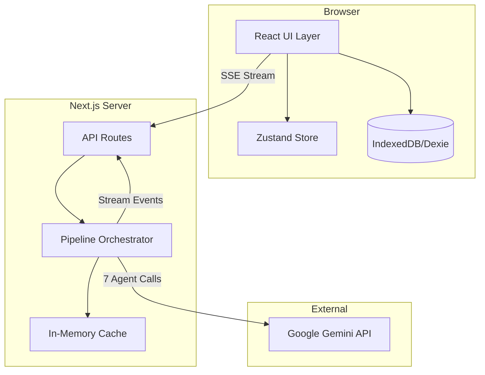

# GCCP System Architecture

## Overview
GCCP is a local-first Next.js web application using a 7-agent AI pipeline for educational content generation.

## Architecture Diagram


## Data Flow
1. User enters topic/subtopics in Editor
2. Frontend sends POST to `/api/generate`
3. API route creates pipeline orchestrator
4. Pipeline runs 7 agents sequentially via Gemini API
5. Each agent's progress/output streams back via SSE
6. Frontend updates Zustand store reactively
7. On completion, generation saved to IndexedDB

## Tech Stack
- **Runtime**: Next.js 16 (App Router + Turbopack)
- **Language**: TypeScript 5.9 (strict)
- **Styling**: Tailwind CSS v4 + shadcn/ui
- **State**: Zustand 5 (client) + React state
- **Storage**: Dexie.js (IndexedDB wrapper)
- **AI**: Google Generative AI SDK (Gemini)
- **Streaming**: Server-Sent Events (ReadableStream)

## Key Directories
```
src/
├── app/           # Next.js pages and API routes
├── components/    # React components (ui, layout, features, shared)
├── lib/           # Business logic (ai, storage, store, hooks, types)
├── config/        # App configuration
└── styles/        # Global styles
```
