# GCCP Architecture Documentation

## Overview

The Generative Course Content Platform (GCCP) is a modern, cloud-native application built on a multi-agent AI architecture. It generates educational content through a sophisticated pipeline of specialized AI agents, with real-time progress tracking and robust error handling.

**Version:** 2.0.0  
**Last Updated:** 2026-01-30

---

## Table of Contents

1. [System Architecture](#system-architecture)
2. [Data Flow](#data-flow)
3. [Component Interactions](#component-interactions)
4. [Database Schema](#database-schema)
5. [Agent Architecture](#agent-architecture)
6. [Technology Stack](#technology-stack)

---

## System Architecture

### High-Level Architecture Diagram

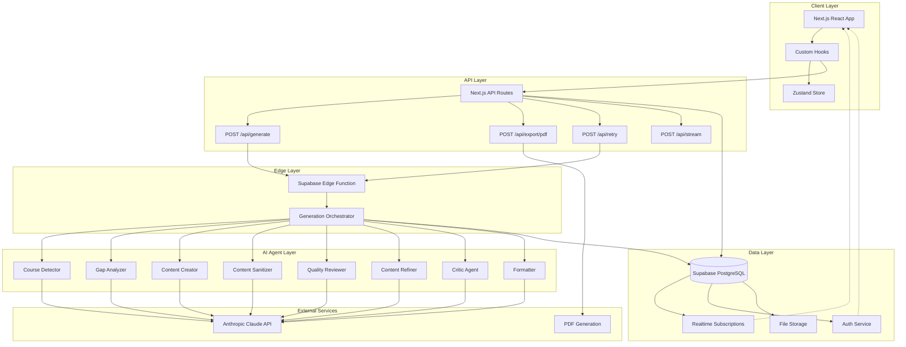

### Architecture Layers

| Layer | Technology | Responsibility |
|-------|------------|----------------|
| **Presentation** | Next.js 16, React 19, Tailwind CSS | UI rendering, user interactions |
| **State Management** | Zustand, TanStack Query | Client state, server state caching |
| **API** | Next.js API Routes | HTTP endpoints, request handling |
| **Edge Compute** | Supabase Edge Functions (Deno) | AI orchestration, background processing |
| **AI/ML** | Anthropic Claude API | Content generation, analysis |
| **Data** | Supabase PostgreSQL | Persistent storage, real-time subscriptions |
| **Auth** | Supabase Auth | User authentication, authorization |

---

## Data Flow

### Content Generation Flow

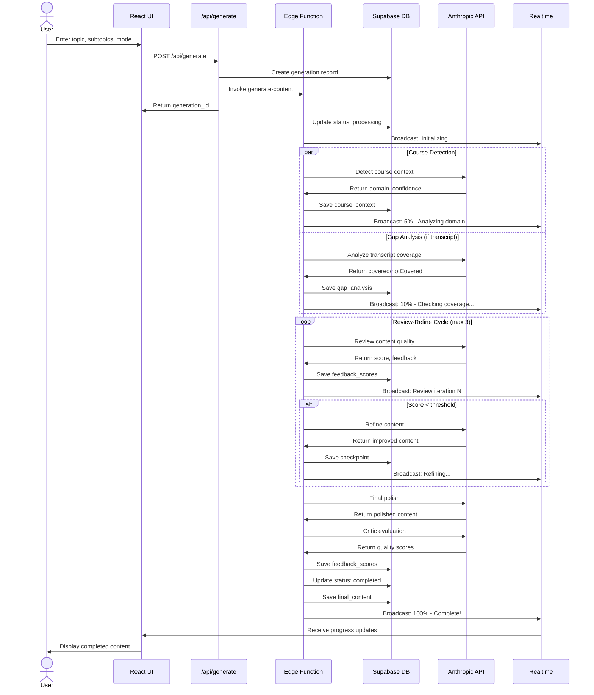

### PDF Export Flow

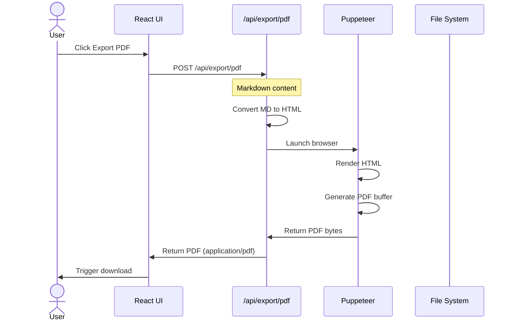

### Real-time Progress Flow

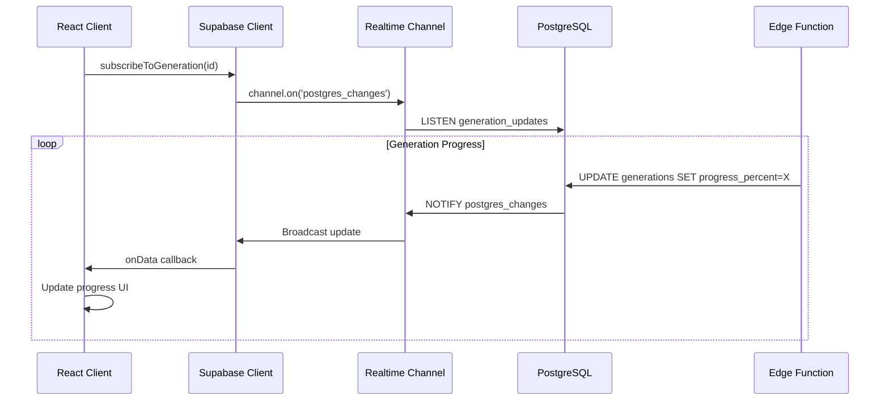

---

## Component Interactions

### Frontend Components

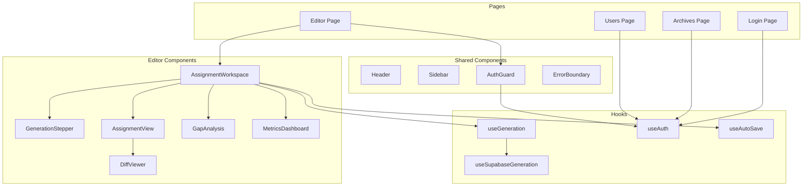

### Agent Interactions

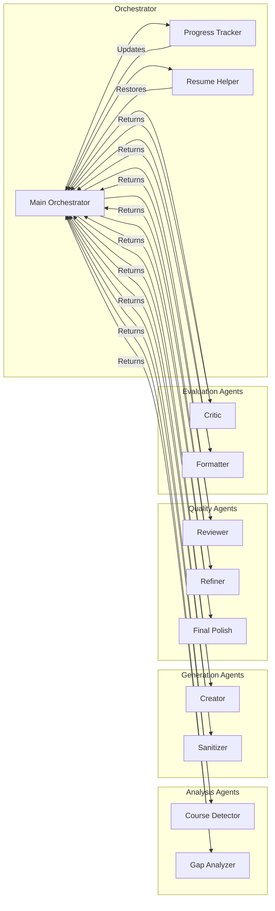

---

## Database Schema

### Entity Relationship Diagram

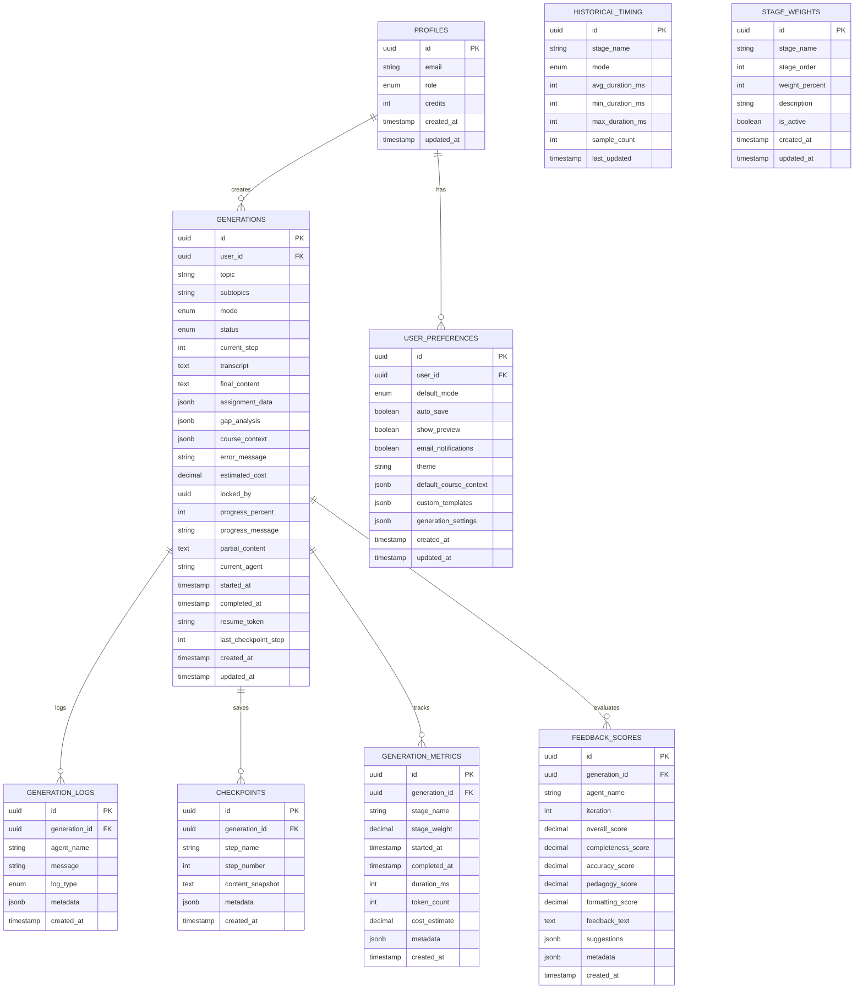

### Table Descriptions

#### `profiles`
Extends Supabase Auth with application-specific user data.

| Column | Type | Description |
|--------|------|-------------|
| `id` | UUID | Primary key, references auth.users |
| `email` | TEXT | User email address |
| `role` | ENUM | 'admin' or 'user' |
| `credits` | INTEGER | Generation credits remaining |

#### `generations`
Core table storing content generation jobs.

| Column | Type | Description |
|--------|------|-------------|
| `id` | UUID | Unique generation identifier |
| `user_id` | UUID | Owner of the generation |
| `topic` | TEXT | Main generation topic |
| `subtopics` | TEXT | Comma-separated subtopics |
| `mode` | ENUM | 'pre-read', 'lecture', or 'assignment' |
| `status` | ENUM | Current generation status |
| `final_content` | TEXT | Generated content output |
| `progress_percent` | INTEGER | Real-time progress (0-100) |
| `resume_token` | TEXT | Token for resuming interrupted jobs |

#### `generation_metrics`
Performance tracking for each pipeline stage.

| Column | Type | Description |
|--------|------|-------------|
| `stage_name` | TEXT | Name of the pipeline stage |
| `duration_ms` | INTEGER | Time spent in stage |
| `token_count` | INTEGER | Tokens consumed |
| `cost_estimate` | DECIMAL | Estimated API cost |

#### `feedback_scores`
Quality evaluation results from Critic and Reviewer agents.

| Column | Type | Description |
|--------|------|-------------|
| `overall_score` | DECIMAL | 0.00-1.00 quality score |
| `completeness_score` | DECIMAL | Content completeness |
| `accuracy_score` | DECIMAL | Factual accuracy |
| `pedagogy_score` | DECIMAL | Educational quality |
| `formatting_score` | DECIMAL | Structure and formatting |

---

## Agent Architecture

### Agent Hierarchy

```mermaid
graph TB
    subgraph "Base"
        Base[BaseAgent]
    end

    subgraph "Specialized Agents"
        CD[CourseDetectorAgent]
        AN[AnalyzerAgent]
        CR[CreatorAgent]
        SN[SanitizerAgent]
        RV[ReviewerAgent]
        RF[RefinerAgent]
        CT[CriticAgent]
        VD[ValidatorAgent]
        FM[FormatterAgent]
    end

    subgraph "Utilities"
        AU[assignment-validator]
        SU[content-sanitizer]
        JP[json-parser]
        TD[text-diff]
    end

    Base --> CD
    Base --> AN
    Base --> CR
    Base --> SN
    Base --> RV
    Base --> RF
    Base --> CT
    Base --> VD
    Base --> FM

    CD -.-> JP
    AN -.-> JP
    CR -.-> JP
    SN -.-> SU
    RV -.-> AU
    RF -.-> TD
    CT -.-> AU
    FM -.-> JP
```

### Agent Responsibilities

| Agent | Purpose | Input | Output |
|-------|---------|-------|--------|
| **CourseDetector** | Identify subject domain | Topic, subtopics, transcript | Domain, confidence, characteristics |
| **Analyzer** | Analyze transcript coverage | Subtopics, transcript | Covered/partially covered/not covered |
| **Creator** | Generate initial content | Topic, subtopics, context | Draft content |
| **Sanitizer** | Verify against transcript | Content, transcript | Sanitized content |
| **Reviewer** | Quality assessment | Content, mode, context | Score, feedback, needsPolish |
| **Refiner** | Improve based on feedback | Content, feedback | Refined content |
| **Critic** | Comprehensive evaluation | Content, mode, transcript | Category scores, recommendations |
| **Formatter** | Structure output | Raw content | Formatted JSON/data |

### Agent Execution Flow

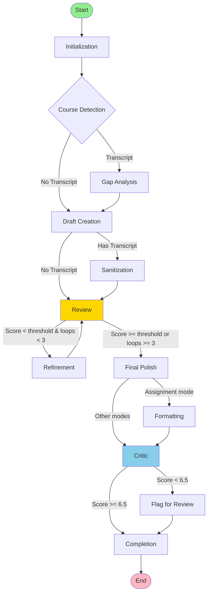

---

## Technology Stack

### Core Technologies

| Category | Technology | Version | Purpose |
|----------|------------|---------|---------|
| **Framework** | Next.js | 16.1.4 | React framework with App Router |
| **UI Library** | React | 19.2.3 | Component library |
| **Language** | TypeScript | 5.x | Type safety |
| **Styling** | Tailwind CSS | 3.4.17 | Utility-first CSS |
| **Database** | PostgreSQL | 15+ | Primary data store |
| **Auth** | Supabase Auth | 2.x | Authentication |
| **AI** | Anthropic Claude | Sonnet 4.5 | Content generation |

### Key Dependencies

```json
{
  "@anthropic-ai/sdk": "^0.71.2",
  "@supabase/supabase-js": "^2.93.1",
  "@supabase/ssr": "^0.8.0",
  "@tanstack/react-query": "^5.90.19",
  "@monaco-editor/react": "^4.7.0",
  "puppeteer": "^24.36.1",
  "zustand": "^5.0.10",
  "markdown-it": "^14.1.0",
  "mermaid": "^11.12.2"
}
```

### Infrastructure

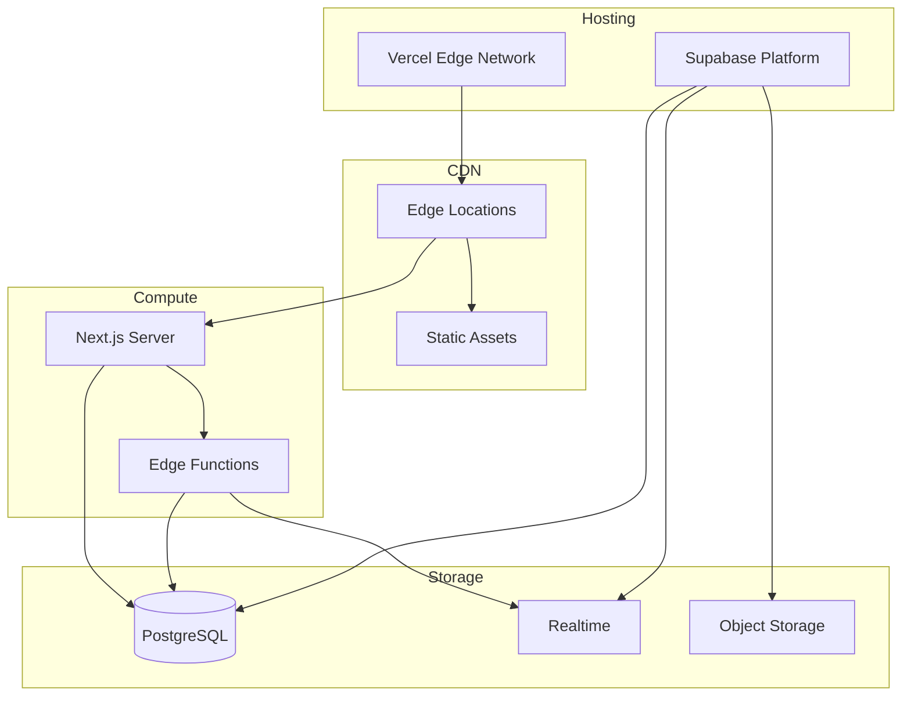

### Security Architecture

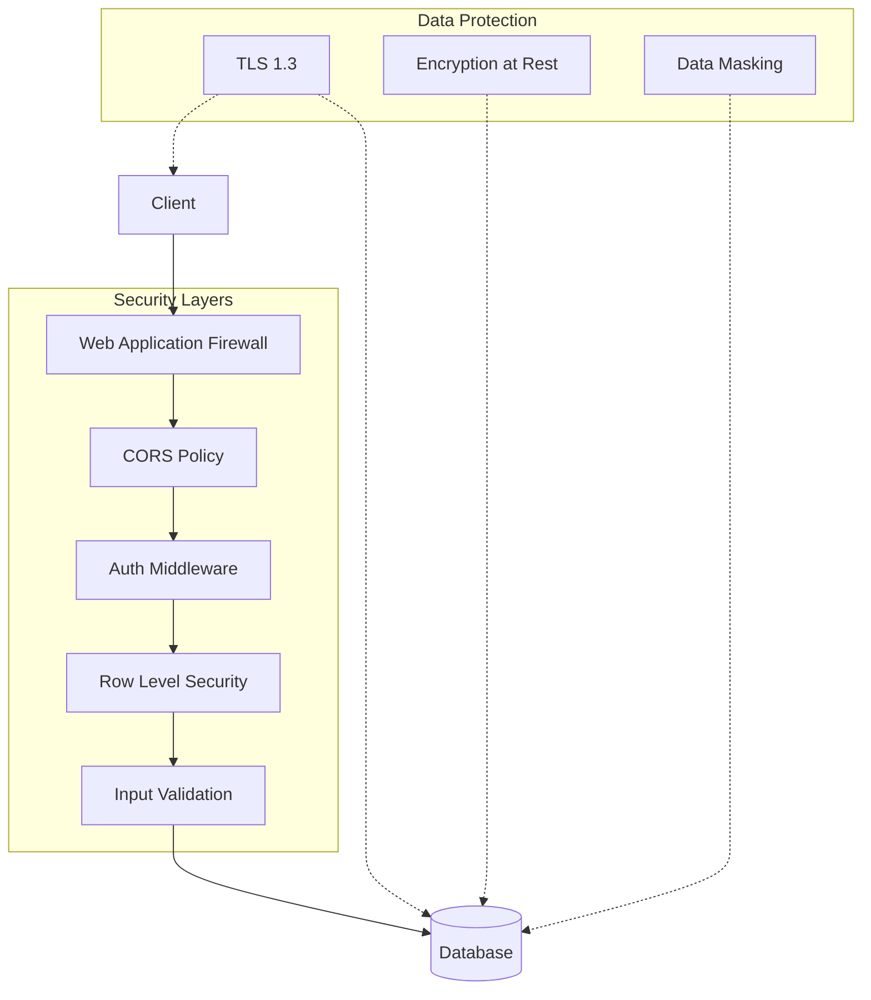

---

## Performance Considerations

### Caching Strategy

| Layer | Cache Type | TTL | Purpose |
|-------|------------|-----|---------|
| CDN | Static assets | 1 year | JS, CSS, images |
| API | Response cache | 5 min | Public data |
| Database | Query cache | Varies | Frequently accessed |
| Client | SWR/TanStack Query | Configurable | Server state |

### Optimization Techniques

1. **Edge Function Caching**: Cache AI responses for identical inputs
2. **Database Indexing**: Strategic indexes on frequently queried columns
3. **Lazy Loading**: Dynamic imports for heavy components
4. **Streaming**: Progressive content delivery for generations
5. **Connection Pooling**: Efficient database connection reuse

---

## Scalability

### Horizontal Scaling

- **Stateless API**: Next.js API routes are stateless
- **Database**: Supabase handles connection pooling
- **Edge Functions**: Auto-scaling based on demand
- **File Storage**: CDN-backed object storage

### Load Handling

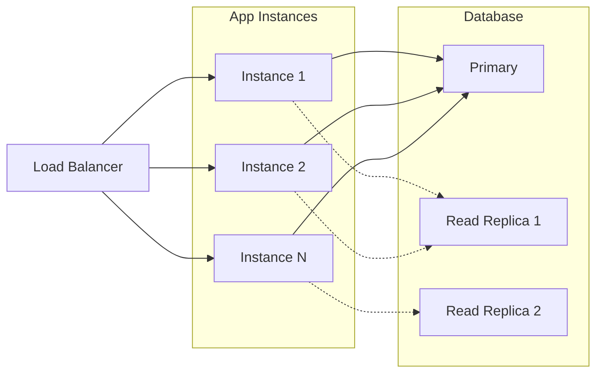

---

## Monitoring & Observability

### Metrics Tracked

| Metric | Type | Alert Threshold |
|--------|------|-----------------|
| API Response Time | Histogram | > 2s p95 |
| Error Rate | Counter | > 1% |
| Generation Duration | Histogram | > 60s average |
| Database Connections | Gauge | > 80% capacity |
| Anthropic API Latency | Histogram | > 10s |

### Logging Levels

- **ERROR**: Failures requiring immediate attention
- **WARN**: Anomalies that don't block functionality
- **INFO**: Significant business events
- **DEBUG**: Detailed troubleshooting data

See [MONITORING.md](./MONITORING.md) for complete monitoring setup.
