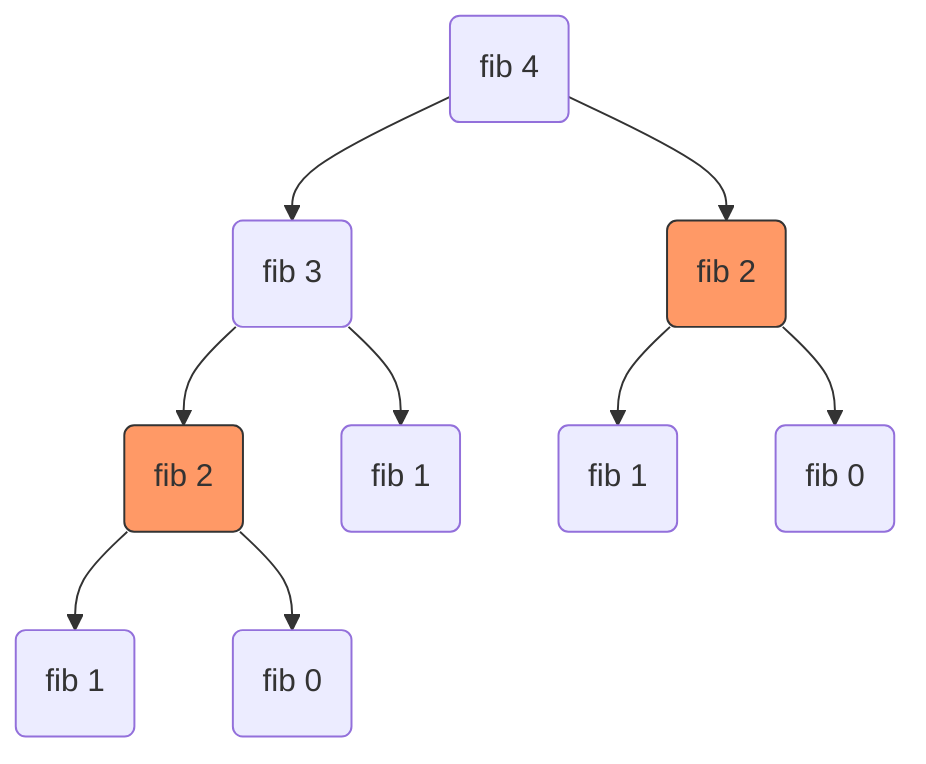

# Lecture Notes: Recursion Mastery

### Learning Objectives
By the end of this module, you will be able to:
1.  **Deconstruct** the execution flow of recursive functions by tracing the lifecycle of stack frames in memory.
2.  **Implement** robust recursive algorithms in Python by correctly identifying base cases and recursive steps.
3.  **Analyze** the time and space complexity of recursive solutions using recurrence relations and recursion trees.
4.  **Debug** infinite recursion and stack overflows by utilizing depth-tracking print techniques.

---

## The Mechanics of Recursion: The Call Stack Lifecycle

### Understanding the Recursive Leap
Recursion is often described simply as "a function calling itself," but this definition obscures the mechanical reality. A better mental model is **delegation**. When a recursive function executes, it does not solve the entire problem at once. Instead, it performs a small unit of work and delegates the remainder of the problem to a *new copy* of itself. This continues until the problem is so small that the answer is trivial.

To understand how this works physically within the computer, you must visualize the **Call Stack**. The stack is a region of memory that tracks active function calls. Every time a function is called, the computer pushes a new **stack frame** onto the top of the stack. This frame contains the function's local variables, arguments, and the specific line number where execution paused. Crucially, the *caller* pauses execution completely and waits for the *callee* to finish.


In an iterative loop, you update the state variables (like `i` or `count`) within a single scope. In recursion, the "state" is preserved in the distinctive stack frames. Each frame represents a specific snapshot of the problem at a specific depth. The logic relies on a "Leap of Faith": assuming the recursive call will return the correct result for a smaller input, you build your current result on top of it.

### The Anatomy of a Recursive Function
Every functional recursive algorithm must possess two distinct components to prevent a program crash:

1.  **The Base Case**: This is the stopping condition. It handles the simplest possible input (e.g., an empty list, the number 0, or a leaf node) and returns a value immediately without making further calls. Without this, the stack grows infinitely until memory is exhausted.
2.  **The Recursive Step**: This is where the function calls itself with a modified input. The input *must* move closer to the base case with every call. This step usually combines the result of the recursive call with some local processing. The work performed after the recursive call returns is often referred to as the unwinding phase, where the deferred operations (like multiplication in factorial) are finally executed.

> 💡 **Pro Tip**: When designing a recursive function, write the Base Case first. It anchors your logic and handles edge cases (like empty inputs) immediately, preventing `IndexError` or `NoneType` exceptions later.

### Example: The Recursive Countdown
Tracing a simple countdown demonstrates the stack in action.

```python
def countdown(n):
    # 1. Base Case
    if n == 0:
        print("Liftoff!")
        return

    # 2. Recursive Step
    print(f"T-minus {n}")
    countdown(n - 1)  # The function pauses here!
    print(f"Returning from {n}")  # This runs after the child returns

# Trigger execution
countdown(3)
```

**Execution Trace:**
1.  `countdown(3)` prints "T-minus 3", then calls `countdown(2)`. **Stack: [3]**
2.  `countdown(2)` prints "T-minus 2", then calls `countdown(1)`. **Stack: [3, 2]**
3.  `countdown(1)` prints "T-minus 1", then calls `countdown(0)`. **Stack: [3, 2, 1]**
4.  `countdown(0)` hits the Base Case. Prints "Liftoff!" and returns. **Stack pops 0.**
5.  `countdown(1)` resumes. Prints "Returning from 1". Returns. **Stack pops 1.**
6.  `countdown(2)` resumes. Prints "Returning from 2". Returns. **Stack pops 2.**
7.  `countdown(3)` resumes. Prints "Returning from 3". Returns. **Stack empty.**

---

## Complexity Analysis: Time and Space on the Stack

### Space Complexity: The Hidden Cost
In iterative solutions, space complexity is often $O(1)$ because you reuse the same variables. In recursion, space complexity is determined by the **maximum height of the call stack**. If a function calls itself $n$ times before hitting the base case, it occupies $O(n)$ memory, even if no lists or dictionaries are created.

Each stack frame consumes a non-trivial amount of memory to store return addresses and local scope. For a recursion depth of 10,000, Python must maintain 10,000 active frames simultaneously. This is why recursion is risky for "deep" problems (like traversing a linked list with 100,000 nodes) but excellent for "shallow" but complex problems (like traversing a balanced binary tree, where depth is $\log n$).

### Time Complexity: Recurrence Relations
To analyze time complexity, we count the total number of recursive calls and the work done inside each call. We often express this using a **recurrence relation**.

For a linear recursion (like factorial):
$$T(n) = T(n-1) + O(1)$$
This states that the time to process $n$ is the time to process $n-1$ plus a constant amount of work. This resolves to $O(n)$.

For a branching recursion (like naive Fibonacci):
$$T(n) = T(n-1) + T(n-2) + O(1)$$
This relation implies the work doubles at every step, leading to exponential complexity $O(2^n)$.

> **Deep Dive: The Master Theorem**
> For divide-and-conquer algorithms (like Merge Sort), the relation looks like $T(n) = aT(n/b) + f(n)$. The Master Theorem provides a template to solve these, but intuitively: if you divide the problem size by 2 ($b=2$) and do linear work to merge ($f(n) = n$), the complexity is typically $O(n \log n)$.

---

## Classic Linear Recursion Patterns

### Factorial: The Accumulator Pattern
Factorial ($n!$) is the product of all positive integers less than or equal to $n$. It is the standard example of linear recursion because the mathematical definition is recursive: $n! = n \times (n-1)!$.

```python
def factorial(n):
    """Calculates n! recursively."""
    # Base Case: 0! and 1! are both 1
    if n <= 1:
        return 1
    
    # Recursive Step: n * result of (n-1)
    sub_result = factorial(n - 1)
    return n * sub_result
```

**Memory Visualization**:
If we call `factorial(5)`, the return value isn't calculated until the stack hits the bottom. The multiplication happens during the "unwinding" phase.
`5 * (4 * (3 * (2 * 1)))`
The computer cannot perform `5 * ...` until `factorial(4)` returns its value.

### Power Calculation: Reducing the Problem Space
Calculating $x^n$ can be done by multiplying $x$ by itself $n$ times. However, we can also define it recursively: $x^n = x \times x^{n-1}$.

```python
def power(base, exponent):
    """Calculates base^exponent."""
    # Base Case: Any number to the power of 0 is 1
    if exponent == 0:
        return 1
    
    # Recursive Step
    return base * power(base, exponent - 1)
```
This is $O(n)$. Note that we can optimize this to $O(\log n)$ by using the property $x^n = x^{n/2} \times x^{n/2}$. If $n$ is even, we only need to calculate half the depth.

### String Reversal: Slicing and Stacking
Reversing a string recursively demonstrates how to break down data structures. The logic is: "The reverse of a string is the last character, followed by the reverse of everything else."

```python
def reverse_string(s):
    # Base Case: Empty string or single char is already reversed
    if len(s) <= 1:
        return s
    
    # Recursive Step: Last char + reverse(middle part) + First char
    # Or simply: Last char + reverse(rest)
    # Here we take the last char, and append the reversed remainder
    return s[-1] + reverse_string(s[:-1])

print(reverse_string("recursion")) # "noisrucer"
```
> ⚠️ **Warning**: String slicing `s[:-1]` in Python creates a copy of the string. Doing this recursively results in $O(n^2)$ space complexity because we create a new string at every stack frame. An iterative pointer approach is much more memory efficient here.

---

## Branching Recursion: Fibonacci and Trees

### The Fibonacci Trap
The Fibonacci sequence is defined as $F(n) = F(n-1) + F(n-2)$. Implementing this directly translates to code that branches twice per function call.

```python
def fibonacci(n):
    if n <= 1:
        return n
    return fibonacci(n - 1) + fibonacci(n - 2)
```

While elegant, this is computationally disastrous for large $n$. To calculate `fibonacci(5)`, the code calculates `fibonacci(3)` twice and `fibonacci(2)` three times. This creates a **recursion tree** that grows exponentially.

| Input (n) | Approximate Calls |
| :--- | :--- |
| 10 | 177 |
| 20 | 21,891 |
| 30 | 2,692,537 |
| 40 | 204,668,309 |

**Visualization of Redundant Work (fib(4)):**


This demonstrates why knowing the Big O is critical. An $O(2^n)$ algorithm is unusable for non-trivial inputs.

### Fixing Branching with Memoization
We can optimize branching recursion by caching results. This is called **memoization**. Before performing a calculation, we check if we've already stored the answer for that input.

```python
memo = {}

def fib_memo(n):
    if n in memo:
        return memo[n]
    if n <= 1:
        return n
    
    # Store result before returning
    result = fib_memo(n - 1) + fib_memo(n - 2)
    memo[n] = result
    return result
```
This reduces the time complexity from $O(2^n)$ to $O(n)$, as we only calculate each number once.

---

## Debugging and Safety

### Visualizing Stack Depth
Debugging recursion is difficult because the code looks the same, but the state changes invisibly. A powerful technique is to pass a `depth` argument to your function purely for logging purposes. This allows you to indent your print statements, visually reconstructing the call stack in your console.

```python
def debug_factorial(n, depth=0):
    indent = "  " * depth
    print(f"{indent}Call: factorial({n})")
    
    if n <= 1:
        print(f"{indent}Base case hit! Returning 1")
        return 1
        
    result = n * debug_factorial(n - 1, depth + 1)
    print(f"{indent}Returning: {result}")
    return result

debug_factorial(3)
```

**Console Output:**
```text
Call: factorial(3)
  Call: factorial(2)
    Call: factorial(1)
    Base case hit! Returning 1
  Returning: 2
Returning: 6
```

### Handling Stack Overflow
Python has a default recursion limit (usually 1000) to prevent infinite recursion from crashing the C-level stack and segfaulting the interpreter. When this limit is reached, Python raises a `RecursionError`.

**Common Causes:**
1.  **Missing Base Case**: The function calls itself indefinitely.
2.  **Incorrect Step**: The recursive call uses the same input as the parent (e.g., `factorial(n)` calling `factorial(n)` instead of `factorial(n-1)`).
3.  **Input too large**: The algorithm is correct, but the data requires a depth > 1000 (e.g., traversing a list with 5000 elements).

> 💡 **Pro Tip**: You can increase the limit using `sys.setrecursionlimit()`, but this is usually a band-aid. If you are hitting the limit, consider whether your algorithm should be iterative.

---

## Recursion vs. Iteration: Making the Choice

### The Trade-off Matrix
Every recursive algorithm can be rewritten iteratively (using loops), and vice-versa (using an explicit stack data structure). The choice depends on the trade-off between **code clarity** and **memory efficiency**.

| Feature | Recursion | Iteration |
| :--- | :--- | :--- |
| **State Management** | Implicit (handled by call stack) | Explicit (variables/counters) |
| **Memory Usage** | High (Stack overhead) | Low (Constant space usually) |
| **Readability** | High for trees, graphs, divide-and-conquer | High for linear lists, simple counters |
| **Risk** | Stack Overflow | Infinite Loops (CPU freeze) |

### Code Comparison: State Management
To visualize the difference between implicit and explicit state, compare these two implementations of factorial.

```python
# RECURSIVE (Implicit State)
# State is held in stack frames
def factorial_rec(n):
    if n <= 1: return 1
    return n * factorial_rec(n - 1)

# ITERATIVE (Explicit State)
# State is held in local variables
def factorial_iter(n):
    result = 1
    for i in range(2, n + 1):
        result *= i
    return result
```

### When to Use Which?
1.  **Use Recursion** when the data structure is naturally recursive, such as:
    *   File system directories (folders inside folders).
    *   JSON or HTML parsing (nested tags/objects).
    *   Tree traversals (binary search trees, DOM trees).
    *   Graph algorithms (Depth-First Search).

2.  **Use Iteration** when processing linear data or when performance is critical:
    *   Simple lists or arrays.
    *   Calculating simple sums or counters.
    *   Environments with limited memory (embedded systems).

### Python's Tail Call Limitation
Some languages optimize "Tail Recursion" (where the recursive call is the very last action) by reusing the current stack frame, effectively turning recursion into iteration under the hood. **Python does NOT support Tail Call Optimization.** Therefore, a recursive solution in Python will always consume stack frames proportional to the depth. For deep linear problems, always prefer iteration in Python.

---

### Key Takeaways
*   **The Stack is Real**: Recursion isn't magic; it's a physical process of pushing and popping stack frames. Each frame consumes memory.


*   **Base Cases are Mandatory**: Always write your exit condition first. It prevents infinite loops and crashes.
*   **Trust the Return**: When writing the recursive step, assume the function call works for the smaller input. Don't try to mentally simulate the whole chain at once.
*   **Identify Overlap**: If your recursive tree calculates the same input multiple times (like Fibonacci), you must use memoization or switch to iteration.
*   **Visualize Depth**: Use indentation in print statements to debug the flow of execution and understand the order of operations.
*   **Know the Limits**: Python's recursion limit exists to protect the system. If you hit it, refactor logic or switch to iteration rather than just increasing the limit.


