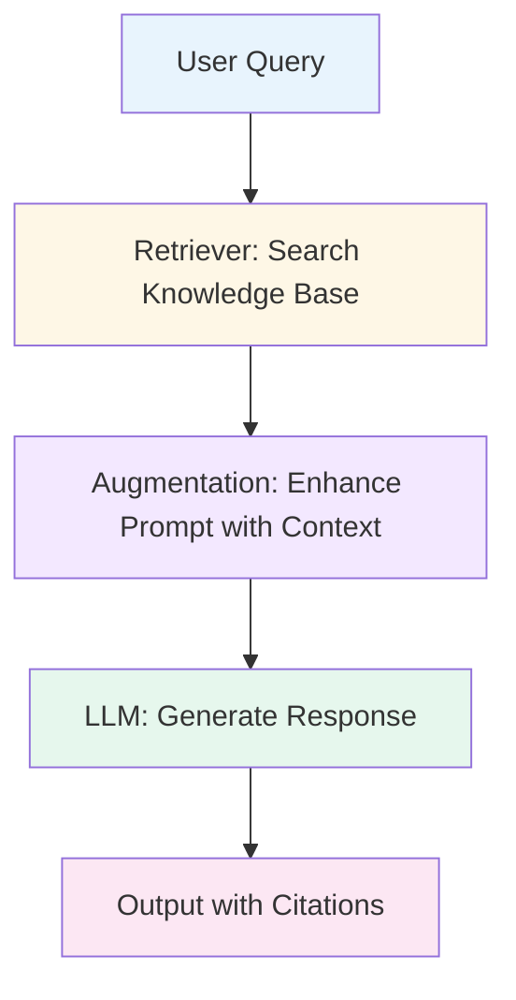

## Lecture Notes: RAG Fundamentals: Concepts, Use Cases, and Tools for Product Managers

### Learning Objectives

- **Explain** why traditional LLMs fail for enterprise applications and how RAG solves these limitations
- **Design** a RAG system architecture with proper data storage, retrieval, and augmentation components
- **Evaluate** when to implement RAG versus alternatives like fine-tuning or custom GPTs for specific product use cases
- **Implement** role-based access controls and privacy measures in RAG systems to protect proprietary data

---

<div style="margin: 32px 0 20px 0; padding-bottom: 8px; border-bottom: 2px solid #e2e8f0;">
  <h3 style="margin: 0; color: #334155;">Understanding the Problem: Why LLMs Need RAG</h3>
</div>

<p style="margin: 16px 0; line-height: 1.8; color: #374151;">Before we dive into RAG, you need to understand why it exists. You've probably used ChatGPT, Claude, or Perplexity and noticed they're brilliant—until they're not. They know vast amounts of information, write fluently, and format outputs beautifully. But they have fundamental problems that make them unreliable for enterprise applications.</p>

<div style="background: linear-gradient(135deg, #f8fafc 0%, #f1f5f9 100%); border: 1px solid #e2e8f0; border-radius: 12px; padding: 20px 24px; margin: 24px 0; box-shadow: 0 1px 3px rgba(0,0,0,0.05);">
  <div style="font-weight: 600; color: #475569; margin-bottom: 12px; font-size: 1.1em;">🎯 The Core Problem</div>
  <p style="color: #64748b; margin: 0; line-height: 1.7;">LLMs are trained once on static data. They can't access information added after their training cutoff, can't read your company's proprietary documents, and will confidently make up answers (hallucinate) when they don't know something.</p>
</div>

<p style="margin: 16px 0; line-height: 1.8; color: #374151;">Think about this real scenario: Indigo Airlines introduced a no-questions-asked cancellation policy in December after their operational chaos. Passengers knew about it from the CEO's announcement. But Indigo's chatbot kept telling customers they'd be charged cancellation fees—because it wasn't trained on the latest policy. Customers lost trust immediately. Indigo's social media mentions spiked with complaints, and their customer service team spent weeks manually correcting the chatbot's misinformation—exactly the problem automation was supposed to solve.</p>

**The Three Critical Limitations:**

<ul style="list-style: none; padding: 0; margin: 16px 0;">
  <li style="padding: 8px 0 8px 24px; position: relative; line-height: 1.6;"><span style="position: absolute; left: 0; color: #6366f1;">•</span> <strong>Static Knowledge:</strong> Training data gets outdated. If you trained a model in September 2023, it doesn't know about events in January 2025.</li>
  <li style="padding: 8px 0 8px 24px; position: relative; line-height: 1.6;"><span style="position: absolute; left: 0; color: #6366f1;">•</span> <strong>Hallucination:</strong> When LLMs don't know an answer, they generate plausible-sounding nonsense. Once you catch them lying, they apologize and promise not to do it again—then repeat the same mistake.</li>
  <li style="padding: 8px 0 8px 24px; position: relative; line-height: 1.6;"><span style="position: absolute; left: 0; color: #6366f1;">•</span> <strong>No Access to Private Data:</strong> Your company's internal documents, customer data, and proprietary knowledge don't exist in the LLM's training set.</li>
</ul>

<div style="background-color: #fef7e6; border-left: 4px solid #f5a623; padding: 16px 20px; margin: 20px 0; border-radius: 0 8px 8px 0;">
  <div style="font-weight: 600; color: #b8860b; margin-bottom: 8px;">⚠️ The Enterprise Trust Problem</div>
  <p style="color: #92702b; margin: 0; line-height: 1.6;">You can't build a customer-facing product on technology that makes up answers. Imagine your support chatbot telling customers incorrect refund policies or your internal assistant sharing salary data with unauthorized employees. These aren't hypothetical—they're real risks.</p>
</div>

<p style="margin: 16px 0; line-height: 1.8; color: #374151;">Here's what makes this worse: users expect LLMs to have the latest information because they're so confident in their responses. When you ask about a building that burned down yesterday, the LLM tells you it's fine—because its training data says so. The gap between user expectations and LLM capabilities creates a trust crisis.</p>

---

<div style="margin: 32px 0 20px 0; padding-bottom: 8px; border-bottom: 2px solid #e2e8f0;">
  <h3 style="margin: 0; color: #334155;">What is RAG? The Solution Explained</h3>
</div>

<div style="background: linear-gradient(135deg, #f8fafc 0%, #f1f5f9 100%); border: 1px solid #e2e8f0; border-radius: 12px; padding: 20px 24px; margin: 24px 0; box-shadow: 0 1px 3px rgba(0,0,0,0.05);">
  <div style="font-weight: 600; color: #475569; margin-bottom: 12px; font-size: 1.1em;">🎯 RAG Definition</div>
  <p style="color: #64748b; margin: 0; line-height: 1.7;"><strong>Retrieval-Augmented Generation (RAG)</strong> is a technique that enhances LLM responses by fetching relevant information from external knowledge sources and adding it to the prompt before generating an answer. The LLM never gets trained on your data—it just borrows it temporarily for each answer.</p>
</div>

<p style="margin: 16px 0; line-height: 1.8; color: #374151;">Let's break down what each word means:</p>

<table style="width: 100%; border-collapse: separate; border-spacing: 0; margin: 24px 0; border-radius: 8px; overflow: hidden; border: 1px solid #e2e8f0;">
  <tr style="background: linear-gradient(135deg, #f8fafc 0%, #f1f5f9 100%);">
    <th style="padding: 14px 16px; text-align: left; font-weight: 600; color: #475569; border-bottom: 1px solid #e2e8f0;">Component</th>
    <th style="padding: 14px 16px; text-align: left; font-weight: 600; color: #475569; border-bottom: 1px solid #e2e8f0;">What It Does</th>
  </tr>
  <tr>
    <td style="padding: 14px 16px; color: #64748b; border-bottom: 1px solid #f1f5f9;"><strong>Retrieval</strong></td>
    <td style="padding: 14px 16px; color: #64748b; border-bottom: 1px solid #f1f5f9;">Fetch the most relevant information from your knowledge base (documents, databases, websites)</td>
  </tr>
  <tr>
    <td style="padding: 14px 16px; color: #64748b; border-bottom: 1px solid #f1f5f9;"><strong>Augmented</strong></td>
    <td style="padding: 14px 16px; color: #64748b; border-bottom: 1px solid #f1f5f9;">Add that retrieved information to your original prompt, making it richer with context</td>
  </tr>
  <tr>
    <td style="padding: 14px 16px; color: #64748b;"><strong>Generation</strong></td>
    <td style="padding: 14px 16px; color: #64748b;">Let the LLM generate a response using both its training and your augmented context</td>
  </tr>
</table>

<p style="margin: 16px 0; line-height: 1.8; color: #374151;">Here's a concrete example. Without RAG, you ask: "When is Taylor Swift's next concert?" The LLM responds: "I don't have access to real-time information. Try checking BookMyShow or her official website."</p>

<p style="margin: 16px 0; line-height: 1.8; color: #374151;">With RAG, the same question triggers this workflow:</p>

<ul style="list-style: none; padding: 0; margin: 16px 0;">
  <li style="padding: 8px 0 8px 24px; position: relative; line-height: 1.6;"><span style="position: absolute; left: 0; color: #6366f1;">•</span> Your system retrieves the latest concert schedule from BookMyShow's database</li>
  <li style="padding: 8px 0 8px 24px; position: relative; line-height: 1.6;"><span style="position: absolute; left: 0; color: #6366f1;">•</span> It augments your prompt: "When is Taylor Swift's next concert? [Context: BookMyShow shows concerts on March 15 in Mumbai and March 18 in Delhi]"</li>
  <li style="padding: 8px 0 8px 24px; position: relative; line-height: 1.6;"><span style="position: absolute; left: 0; color: #6366f1;">•</span> The LLM generates: "Taylor Swift's next concerts are on March 15 in Mumbai and March 18 in Delhi. [Source: BookMyShow]"</li>
</ul>

<div style="background-color: #e6f7ed; border-left: 4px solid #4ade80; padding: 16px 20px; margin: 20px 0; border-radius: 0 8px 8px 0;">
  <div style="font-weight: 600; color: #16a34a; margin-bottom: 8px;">✅ Key Insight</div>
  <p style="color: #22863a; margin: 0; line-height: 1.6;">The LLM's training data never changes. RAG works by making the <em>prompt</em> smarter, not the model. You're giving the LLM a cheat sheet for every question—and the cheat sheet updates automatically.</p>
</div>

---

<div style="margin: 32px 0 20px 0; padding-bottom: 8px; border-bottom: 2px solid #e2e8f0;">
  <h3 style="margin: 0; color: #334155;">How RAG Actually Works: The Complete Pipeline</h3>
</div>

<p style="margin: 16px 0; line-height: 1.8; color: #374151;">RAG isn't magic—it's a carefully orchestrated pipeline with multiple components. Understanding each piece helps you make smart product decisions about implementation, cost, and performance trade-offs.</p>

<div style="background: linear-gradient(135deg, #f8fafc 0%, #f1f5f9 100%); border: 1px solid #e2e8f0; border-radius: 12px; padding: 20px 24px; margin: 24px 0; box-shadow: 0 1px 3px rgba(0,0,0,0.05);">
  <div style="font-weight: 600; color: #475569; margin-bottom: 12px; font-size: 1.1em;">🎯 The RAG Workflow</div>
  <p style="color: #64748b; margin: 0; line-height: 1.7;">When a user asks a question, RAG performs three core operations: <strong>retrieve</strong> relevant information from your knowledge base, <strong>augment</strong> the user's prompt with that information, and <strong>generate</strong> a response using both the LLM's knowledge and your retrieved context.</p>
</div>

**The Five-Step RAG Pipeline:**



<p style="margin: 16px 0; line-height: 1.8; color: #374151;"><em>Each color represents a different system component: blue (input), yellow (retrieval), purple (augmentation), green (generation), pink (output). Notice how your data never touches the LLM training—it only appears in the prompt.</em></p>

<p style="margin: 16px 0; line-height: 1.8; color: #374151;">Here's each step with a real product scenario. Imagine you're building an internal knowledge assistant for your company:</p>

**Step 1: User Query**

<p style="margin: 16px 0; line-height: 1.8; color: #374151;">An employee asks: "What's our parental leave policy?" This question goes to your RAG system, not directly to the LLM.</p>

**Step 2: Retrieval**

<p style="margin: 16px 0; line-height: 1.8; color: #374151;">Your retriever searches your knowledge base—HR documents, policy PDFs, internal wikis—for relevant information. It doesn't just do keyword matching. It performs semantic search, finding documents about "parental leave," "maternity benefits," "paternity policy," and related concepts.</p>

<div style="background-color: #e8f4fd; border-left: 4px solid #4a90d9; padding: 16px 20px; margin: 20px 0; border-radius: 0 8px 8px 0;">
  <div style="font-weight: 600; color: #2d6cb5; margin-bottom: 8px;">💡 Pro Tip</div>
  <p style="color: #3d7abf; margin: 0; line-height: 1.6;">The retriever uses embeddings—mathematical representations of text meaning—to find semantically similar content. "Parental leave" and "maternity benefits" have similar embeddings even though they use different words.</p>
</div>

**Step 3: Augmentation**

<p style="margin: 16px 0; line-height: 1.8; color: #374151;">The system takes the top 5 most relevant document chunks and adds them to the original prompt. Your augmented prompt now looks like this:</p>

<p style="margin: 16px 0; line-height: 1.8; color: #374151;"><em>"What's our parental leave policy? [Context: From HR_Policy_2024.pdf - Employees are entitled to 26 weeks paid parental leave. From Benefits_Guide.pdf - Both parents can take leave simultaneously. From FAQ.pdf - Leave must be taken within 12 months of birth/adoption.]"</em></p>

**Step 4: Generation**

<p style="margin: 16px 0; line-height: 1.8; color: #374151;">This enhanced prompt goes to the LLM (GPT-4, Claude, etc.). The LLM generates a response using both its general knowledge about parental leave policies AND your specific company context.</p>

**Step 5: Output with Citations**

<p style="margin: 16px 0; line-height: 1.8; color: #374151;">The system returns: "Our company offers 26 weeks of paid parental leave. Both parents can take leave simultaneously, and it must be used within 12 months of the child's birth or adoption. [Sources: HR_Policy_2024.pdf, Benefits_Guide.pdf, FAQ.pdf]"</p>

<div style="background-color: #f3e8ff; border-left: 4px solid #a855f7; padding: 16px 20px; margin: 20px 0; border-radius: 0 8px 8px 0;">
  <div style="font-weight: 600; color: #7c3aed; margin-bottom: 8px;">🔮 Remember</div>
  <p style="color: #6d28d9; margin: 0; line-height: 1.6;">The LLM never gets trained on your HR documents. Every time someone asks a question, RAG fetches fresh information and adds it to the prompt. Your data stays under your control.</p>
</div>

---

<div style="margin: 32px 0 20px 0; padding-bottom: 8px; border-bottom: 2px solid #e2e8f0;">
  <h3 style="margin: 0; color: #334155;">External Data Retrieval: The Heart of RAG</h3>
</div>

<p style="margin: 16px 0; line-height: 1.8; color: #374151;">Retrieval is where RAG gets its power—and where most implementations fail. You're not just searching documents; you're building a system that can find the right needle in a massive haystack, every time, in milliseconds.</p>

<div style="background: linear-gradient(135deg, #f8fafc 0%, #f1f5f9 100%); border: 1px solid #e2e8f0; border-radius: 12px; padding: 20px 24px; margin: 24px 0; box-shadow: 0 1px 3px rgba(0,0,0,0.05);">
  <div style="font-weight: 600; color: #475569; margin-bottom: 12px; font-size: 1.1em;">🎯 What Makes Retrieval Different</div>
  <p style="color: #64748b; margin: 0; line-height: 1.7;">Traditional search looks for keyword matches. RAG retrieval understands meaning. When you search for "how to cancel my subscription," it finds documents about "terminating membership," "ending service," and "account closure"—even if they never use the word "cancel."</p>
</div>

**The Retrieval Process Has Five Critical Steps:**

**1. Data Collection**

<p style="margin: 16px 0; line-height: 1.8; color: #374151;">First, gather all your knowledge sources. These might be PDFs, Word documents, SQL databases, internal wikis, or even scraped website content. For a customer support chatbot, you'd collect product documentation, FAQ pages, support tickets, and knowledge base articles.</p>

**2. Parsing and Normalization**

<p style="margin: 16px 0; line-height: 1.8; color: #374151;">Your sources are in different formats—some in English, some in Tamil, some as images, some as structured data. Parse everything into a consistent format. Extract text from images using OCR. Translate everything to a common language. Convert tables and spreadsheets into readable text.</p>

<div style="background-color: #fef7e6; border-left: 4px solid #f5a623; padding: 16px 20px; margin: 20px 0; border-radius: 0 8px 8px 0;">
  <div style="font-weight: 600; color: #b8860b; margin-bottom: 8px;">⚠️ Common Mistake</div>
  <p style="color: #92702b; margin: 0; line-height: 1.6;">Don't skip data cleanup. If you upload duplicate documents or outdated information, your RAG system will confidently cite wrong answers. Garbage in, garbage out—but now with citations that make the garbage look authoritative.</p>
</div>

**3. Chunking**

<p style="margin: 16px 0; line-height: 1.8; color: #374151;">Break your documents into smaller pieces called chunks. A 100-page employee handbook becomes 200 chunks of 500 characters each. Why? Because you can't send an entire handbook to the LLM every time someone asks a question—it's too expensive and too slow.</p>

<p style="margin: 16px 0; line-height: 1.8; color: #374151;">Chunking strategies matter:</p>

<ul style="list-style: none; padding: 0; margin: 16px 0;">
  <li style="padding: 8px 0 8px 24px; position: relative; line-height: 1.6;"><span style="position: absolute; left: 0; color: #6366f1;">•</span> <strong>Fixed character chunks:</strong> Every 500 characters, create a new chunk (simple but can break mid-sentence)</li>
  <li style="padding: 8px 0 8px 24px; position: relative; line-height: 1.6;"><span style="position: absolute; left: 0; color: #6366f1;">•</span> <strong>Semantic chunks:</strong> Break at paragraph or section boundaries (preserves context but creates variable sizes)</li>
  <li style="padding: 8px 0 8px 24px; position: relative; line-height: 1.6;"><span style="position: absolute; left: 0; color: #6366f1;">•</span> <strong>Overlapping chunks:</strong> Include 50 characters from the previous chunk in each new chunk (prevents losing context at boundaries)</li>
</ul>

<p style="margin: 16px 0; line-height: 1.8; color: #374151;">Chunk size is a critical trade-off. Small chunks (200 characters) give precise retrieval but lose context. Large chunks (2000 characters) preserve context but increase latency and cost. Most production systems use 500-800 character chunks with 50-100 character overlap.</p>

<div style="background-color: #fef7e6; border-left: 4px solid #f5a623; padding: 16px 20px; margin: 20px 0; border-radius: 0 8px 8px 0;">
  <div style="font-weight: 600; color: #b8860b; margin-bottom: 8px;">⚠️ Warning: Bad Chunking Breaks RAG</div>
  <p style="color: #92702b; margin: 0; line-height: 1.6;">If you chunk mid-sentence ('...entitled to 26 weeks paid' in one chunk, 'parental leave for both parents...' in another), your retrieval might return incomplete information. An employee asking about leave duration gets 'entitled to 26 weeks paid' without knowing what it applies to. Always test your chunking strategy with edge cases.</p>
</div>

**4. Embedding**

<p style="margin: 16px 0; line-height: 1.8; color: #374151;">Convert each chunk into an embedding—a list of numbers that represents its meaning. The sentence "Our refund policy allows returns within 30 days" becomes something like [0.23, -0.45, 0.67, ...] with hundreds of dimensions.</p>

<p style="margin: 16px 0; line-height: 1.8; color: #374151;">Embeddings capture semantic similarity. "Refund policy" and "return guidelines" have similar embeddings even though they use different words. This is what makes semantic search possible.</p>

<p style="margin: 16px 0; line-height: 1.8; color: #374151;">Think of embeddings as GPS coordinates for meaning. Just as two nearby locations have similar coordinates, two similar concepts have similar embedding values. Your retrieval system uses these coordinates to find the closest matches.</p>

<div style="background-color: #e8f4fd; border-left: 4px solid #4a90d9; padding: 16px 20px; margin: 20px 0; border-radius: 0 8px 8px 0;">
  <div style="font-weight: 600; color: #2d6cb5; margin-bottom: 8px;">💡 Pro Tip</div>
  <p style="color: #3d7abf; margin: 0; line-height: 1.6;">Embedding models are separate from LLMs. OpenAI has text-embedding-3-small, Google has Vertex AI embeddings, and open-source options like Sentence Transformers exist. Choose based on your language support needs and cost constraints.</p>
</div>

**5. Vector Storage**

<p style="margin: 16px 0; line-height: 1.8; color: #374151;">Store these embeddings in a vector database—specialized storage optimized for similarity search. Popular options include Pinecone, Weaviate, Chroma, and FAISS. When a user asks a question, you convert their question to an embedding and find the closest matching document embeddings.</p>

<p style="margin: 16px 0; line-height: 1.8; color: #374151;">This is where retrieval speed matters. Searching through 10,000 documents takes milliseconds with proper vector indexing. Searching through 10 million documents still takes milliseconds—if you've architected it correctly.</p>

<div style="background-color: #e8f4fd; border-left: 4px solid #4a90d9; padding: 16px 20px; margin: 20px 0; border-radius: 0 8px 8px 0;">
  <div style="font-weight: 600; color: #2d6cb5; margin-bottom: 8px;">💡 Product Decision Guide</div>
  <p style="color: #3d7abf; margin: 0; line-height: 1.6;">For product decisions: Pinecone is fully managed (easy but pricey), Weaviate offers more control (moderate complexity), Chroma is open-source (cheapest but requires infrastructure), and FAISS is for research (not production-ready). Most teams start with Pinecone for speed-to-market, then migrate to self-hosted options once they understand their scale requirements.</p>
</div>

**Retrieval Strategies: How Many Results?**

<p style="margin: 16px 0; line-height: 1.8; color: #374151;">When someone asks a question, how many chunks do you retrieve? This is the "top-k" parameter. This isn't just a technical detail—top-k directly impacts your product's cost and latency. Retrieving 10 chunks costs 10x more in tokens than retrieving 1 chunk, and takes proportionally longer. Your PM decision: optimize for accuracy (higher k) or speed and cost (lower k).</p>

<table style="width: 100%; border-collapse: separate; border-spacing: 0; margin: 24px 0; border-radius: 8px; overflow: hidden; border: 1px solid #e2e8f0;">
  <tr style="background: linear-gradient(135deg, #f8fafc 0%, #f1f5f9 100%);">
    <th style="padding: 14px 16px; text-align: left; font-weight: 600; color: #475569; border-bottom: 1px solid #e2e8f0;">Strategy</th>
    <th style="padding: 14px 16px; text-align: left; font-weight: 600; color: #475569; border-bottom: 1px solid #e2e8f0;">When to Use</th>
    <th style="padding: 14px 16px; text-align: left; font-weight: 600; color: #475569; border-bottom: 1px solid #e2e8f0;">Trade-off</th>
  </tr>
  <tr>
    <td style="padding: 14px 16px; color: #64748b; border-bottom: 1px solid #f1f5f9;"><strong>Top-1 (single result)</strong></td>
    <td style="padding: 14px 16px; color: #64748b; border-bottom: 1px solid #f1f5f9;">Simple FAQs with clear answers</td>
    <td style="padding: 14px 16px; color: #64748b; border-bottom: 1px solid #f1f5f9;">Fast and cheap, but misses nuance</td>
  </tr>
  <tr>
    <td style="padding: 14px 16px; color: #64748b; border-bottom: 1px solid #f1f5f9;"><strong>Top-3 to Top-5 (multiple results)</strong></td>
    <td style="padding: 14px 16px; color: #64748b; border-bottom: 1px solid #f1f5f9;">Most production systems—balances context and cost</td>
    <td style="padding: 14px 16px; color: #64748b; border-bottom: 1px solid #f1f5f9;">Good accuracy, manageable token usage</td>
  </tr>
  <tr>
    <td style="padding: 14px 16px; color: #64748b; border-bottom: 1px solid #f1f5f9;"><strong>Top-10+ (many results)</strong></td>
    <td style="padding: 14px 16px; color: #64748b; border-bottom: 1px solid #f1f5f9;">Complex queries needing comprehensive context</td>
    <td style="padding: 14px 16px; color: #64748b; border-bottom: 1px solid #f1f5f9;">Best accuracy but expensive and slow</td>
  </tr>
  <tr>
    <td style="padding: 14px 16px; color: #64748b;"><strong>Top-50+</strong></td>
    <td style="padding: 14px 16px; color: #64748b;">Complex research or legal queries</td>
    <td style="padding: 14px 16px; color: #64748b;">Comprehensive but expensive and slow</td>
  </tr>
</table>

<p style="margin: 16px 0; line-height: 1.8; color: #374151;">You can also set confidence thresholds. "Only retrieve chunks with 85% similarity or higher." This prevents irrelevant results from polluting your context.</p>

<div style="background-color: #e6f7ed; border-left: 4px solid #4ade80; padding: 16px 20px; margin: 20px 0; border-radius: 0 8px 8px 0;">
  <div style="font-weight: 600; color: #16a34a; margin-bottom: 8px;">✅ Key Takeaway</div>
  <p style="color: #22863a; margin: 0; line-height: 1.6;">Retrieval quality determines RAG quality. You can have the best LLM in the world, but if your retriever fetches irrelevant documents, your answers will be garbage. Invest time in chunking strategy, embedding quality, and retrieval tuning.</p>
</div>

---

<div style="margin: 32px 0 20px 0; padding-bottom: 8px; border-bottom: 2px solid #e2e8f0;">
  <h3 style="margin: 0; color: #334155;">Prompt Augmentation: Making Context Work</h3>
</div>

<p style="margin: 16px 0; line-height: 1.8; color: #374151;">You've retrieved relevant chunks. Now what? You can't just dump them into the prompt and hope for the best. Augmentation is where you craft the perfect prompt that combines user intent with retrieved context.</p>

<div style="background: linear-gradient(135deg, #f8fafc 0%, #f1f5f9 100%); border: 1px solid #e2e8f0; border-radius: 12px; padding: 20px 24px; margin: 24px 0; box-shadow: 0 1px 3px rgba(0,0,0,0.05);">
  <div style="font-weight: 600; color: #475569; margin-bottom: 12px; font-size: 1.1em;">🎯 Augmentation Anatomy</div>
  <p style="color: #64748b; margin: 0; line-height: 1.7;">A well-augmented prompt has three parts: system instructions (how to behave), retrieved context (your knowledge base chunks), and the user query (the original question). The LLM sees all three together.</p>
</div>

<p style="margin: 16px 0; line-height: 1.8; color: #374151;">Here's what a production-ready augmented prompt looks like:</p>

```python
# System Instructions (you control this)
system_prompt = """
You are an expert assistant that answers questions using retrieved context 
from the company's document store. Always search for relevant documents 
before responding. If you find relevant context, cite the source using 
[Source: filename.pdf]. If no relevant context exists, clearly state: 
'I could not find this information in our knowledge base. This response 
is based on my general knowledge.'
"""

# Retrieved Context (from your RAG system)
retrieved_context = """
[Document 1 - HR_Policy_2024.pdf]
Employees are entitled to 26 weeks of paid parental leave...

[Document 2 - Benefits_Guide.pdf]
Both parents can take leave simultaneously...

[Document 3 - FAQ.pdf]
Leave must be taken within 12 months of birth or adoption...
"""

# User Query (the original question)
user_query = "What's our parental leave policy?"

# Final Augmented Prompt
final_prompt = f"{system_prompt}\n\nContext:\n{retrieved_context}\n\nQuestion: {user_query}"
```

<p style="margin: 16px 0; line-height: 1.8; color: #374151;">Notice what's happening here. You're giving the LLM explicit instructions on how to use the context, providing the context itself with clear source markers, and then asking the question. The LLM can now generate an answer that references your specific documents.</p>

<div style="background-color: #fef7e6; border-left: 4px solid #f5a623; padding: 16px 20px; margin: 20px 0; border-radius: 0 8px 8px 0;">
  <div style="font-weight: 600; color: #b8860b; margin-bottom: 8px;">⚠️ Common Mistake</div>
  <p style="color: #92702b; margin: 0; line-height: 1.6;">Don't forget to instruct the LLM to cite sources. Without explicit instructions, the LLM will use your context but won't tell you where information came from. You lose the traceability that makes RAG trustworthy.</p>
</div>

**Handling Token Limits**

<p style="margin: 16px 0; line-height: 1.8; color: #374151;">Every LLM has a context window—the maximum number of tokens it can process. GPT-4 supports 8,000 tokens (roughly 6,000 words). If your retrieved context plus user query exceeds this, you have three options:</p>

<ul style="list-style: none; padding: 0; margin: 16px 0;">
  <li style="padding: 8px 0 8px 24px; position: relative; line-height: 1.6;"><span style="position: absolute; left: 0; color: #6366f1;">•</span> <strong>Reduce top-k:</strong> Retrieve fewer chunks (sacrifices comprehensiveness)</li>
  <li style="padding: 8px 0 8px 24px; position: relative; line-height: 1.6;"><span style="position: absolute; left: 0; color: #6366f1;">•</span> <strong>Summarize context:</strong> Use a separate LLM call to condense retrieved chunks (adds latency and cost)</li>
  <li style="padding: 8px 0 8px 24px; position: relative; line-height: 1.6;"><span style="position: absolute; left: 0; color: #6366f1;">•</span> <strong>Use a larger model:</strong> GPT-4 Turbo supports 128,000 tokens (more expensive per request)</li>
</ul>

<p style="margin: 16px 0; line-height: 1.8; color: #374151;">Most production systems aim to keep augmented prompts under 2,000 tokens. This leaves room for the LLM's response while staying within cost-effective models.</p>

---

<div style="margin: 32px 0 20px 0; padding-bottom: 8px; border-bottom: 2px solid #e2e8f0;">
  <h3 style="margin: 0; color: #334155;">Benefits: Why RAG Solves Real Product Problems</h3>
</div>

<p style="margin: 16px 0; line-height: 1.8; color: #374151;">You've seen how RAG works. Now let's talk about why product managers care. RAG solves four critical problems that make LLMs unusable for enterprise applications.</p>

**1. Dynamic Knowledge Updates**

<p style="margin: 16px 0; line-height: 1.8; color: #374151;">Your knowledge base updates automatically. Add a new policy document to Google Drive, and your RAG system picks it up on the next query. No retraining, no deployment, no downtime. For a product manager, this means you can launch features faster—your support chatbot stays current without engineering intervention.</p>

<div style="background: linear-gradient(135deg, #f8fafc 0%, #f1f5f9 100%); border: 1px solid #e2e8f0; border-radius: 12px; padding: 20px 24px; margin: 24px 0; box-shadow: 0 1px 3px rgba(0,0,0,0.05);">
  <div style="font-weight: 600; color: #475569; margin-bottom: 12px; font-size: 1.1em;">🎯 Real Impact</div>
  <p style="color: #64748b; margin: 0; line-height: 1.7;">A SaaS company using RAG for customer support reduced their documentation update lag from 2 weeks (retraining a fine-tuned model) to real-time. When they launched a new feature, the support bot could answer questions immediately.</p>
</div>

**2. Source Attribution and Trust**

<p style="margin: 16px 0; line-height: 1.8; color: #374151;">Every answer includes citations. Users can verify information by clicking through to source documents. This builds trust—especially critical for high-stakes domains like healthcare, finance, or legal services. When your chatbot tells a customer their refund will take 5-7 business days, it cites the refund policy document. The customer can verify it themselves.</p>

**3. Reduced Hallucination**

<p style="margin: 16px 0; line-height: 1.8; color: #374151;">By grounding responses in retrieved documents, RAG dramatically reduces hallucination. The LLM can still make mistakes, but you've given it accurate information to work with. You can also instruct it: "If you don't find relevant context, say 'I don't know' instead of guessing."</p>

<div style="background-color: #e8f4fd; border-left: 4px solid #4a90d9; padding: 16px 20px; margin: 20px 0; border-radius: 0 8px 8px 0;">
  <div style="font-weight: 600; color: #2d6cb5; margin-bottom: 8px;">💡 Pro Tip</div>
  <p style="color: #3d7abf; margin: 0; line-height: 1.6;">Measure hallucination rates before and after implementing RAG. Track what percentage of answers include citations versus pure LLM generation. This metric directly correlates with user trust.</p>
</div>

**4. Data Privacy and Control**

<p style="margin: 16px 0; line-height: 1.8; color: #374151;">Your data never leaves your control. The LLM doesn't get trained on your proprietary information—it just sees it as context during inference. You can implement role-based access controls: HR employees see salary data, but engineers don't. You can encrypt data at rest and in transit. You can delete a document and it immediately stops appearing in responses.</p>

<p style="margin: 16px 0; line-height: 1.8; color: #374151;">This is the killer feature for enterprises. Companies won't adopt AI if it means uploading trade secrets to OpenAI's servers. RAG lets you use powerful LLMs while keeping sensitive data behind your firewall.</p>

**Cost Efficiency (When Done Right)**

<p style="margin: 16px 0; line-height: 1.8; color: #374151;">Fine-tuning a model costs thousands of dollars and requires retraining whenever data changes. RAG has upfront setup costs but lower ongoing costs. You pay for embedding generation (cheap) and LLM inference (moderate). The math works out favorably for most use cases—especially when you implement caching strategies.</p>

<details style="margin: 20px 0; border: 1px solid #e2e8f0; border-radius: 8px; overflow: hidden;">
  <summary style="padding: 16px 20px; background: #f8fafc; cursor: pointer; font-weight: 600; color: #475569;">💡 Click to see cost optimization strategies</summary>
  <div style="padding: 16px 20px; background: #ffffff; border-top: 1px solid #e2e8f0;">
    <ul style="list-style: none; padding: 0; margin: 0;">
      <li style="padding: 8px 0 8px 24px; position: relative; line-height: 1.6;"><span style="position: absolute; left: 0; color: #6366f1;">•</span> <strong>User chat caching:</strong> Store previous conversations and responses. If a user asks the same question twice, return the cached answer without hitting the LLM.</li>
      <li style="padding: 8px 0 8px 24px; position: relative; line-height: 1.6;"><span style="position: absolute; left: 0; color: #6366f1;">•</span> <strong>Global query caching:</strong> If 100 users ask "What's the refund policy?", compute the answer once and cache it for everyone.</li>
      <li style="padding: 8px 0 8px 24px; position: relative; line-height: 1.6;"><span style="position: absolute; left: 0; color: #6366f1;">•</span> <strong>Smaller models for simple queries:</strong> Use GPT-3.5 for straightforward questions, GPT-4 only for complex ones.</li>
      <li style="padding: 8px 0 8px 24px; position: relative; line-height: 1.6;"><span style="position: absolute; left: 0; color: #6366f1;">•</span> <strong>Batch processing:</strong> For non-real-time use cases, batch multiple queries together to reduce API overhead.</li>
    </ul>
  </div>
</details>

---

<div style="margin: 32px 0 20px 0; padding-bottom: 8px; border-bottom: 2px solid #e2e8f0;">
  <h3 style="margin: 0; color: #334155;">Use Cases: Where RAG Shines for Product Managers</h3>
</div>

<p style="margin: 16px 0; line-height: 1.8; color: #374151;">RAG isn't a theoretical concept—it's solving real problems in production today. Let's look at specific use cases where product managers can drive immediate value.</p>

**Customer Support Chatbots**

<p style="margin: 16px 0; line-height: 1.8; color: #374151;">This is the most common RAG application. Your support bot answers questions by referencing help documentation, FAQs, and past support tickets. When a customer asks about shipping times, the bot retrieves the latest shipping policy and provides an accurate answer with a link to the full policy.</p>

<div style="background: linear-gradient(135deg, #f8fafc 0%, #f1f5f9 100%); border: 1px solid #e2e8f0; border-radius: 12px; padding: 20px 24px; margin: 24px 0; box-shadow: 0 1px 3px rgba(0,0,0,0.05);">
  <div style="font-weight: 600; color: #475569; margin-bottom: 12px; font-size: 1.1em;">🎯 Product Impact</div>
  <p style="color: #64748b; margin: 0; line-height: 1.7;"><strong>Metrics that matter:</strong> Track deflection rate (percentage of queries resolved without human escalation), resolution time, and customer satisfaction scores. A well-implemented RAG chatbot can deflect 60-70% of tier-1 support queries.</p>
</div>

**Internal Knowledge Management**

<p style="margin: 16px 0; line-height: 1.8; color: #374151;">Employees spend hours searching for information in Confluence, SharePoint, and Google Drive. A RAG-powered search assistant finds answers across all these sources. "What's our expense reimbursement process?" gets answered with citations from the finance wiki, employee handbook, and recent policy updates.</p>

<p style="margin: 16px 0; line-height: 1.8; color: #374151;">Microsoft's Copilot uses RAG to search across your emails, documents, and Teams chats. It's not magic—it's retrieval-augmented generation applied to your Microsoft 365 data.</p>

**Document Analysis and Q&A**

<p style="margin: 16px 0; line-height: 1.8; color: #374151;">Upload a 200-page legal contract and ask: "What are the termination clauses?" RAG retrieves relevant sections and summarizes them. This works for research papers, financial reports, technical specifications—any document-heavy workflow.</p>

<p style="margin: 16px 0; line-height: 1.8; color: #374151;">Law firms use RAG to search case precedents. Researchers use it to find relevant papers from thousands of publications. Financial analysts use it to extract insights from earnings reports.</p>

**Onboarding and Training**

<p style="margin: 16px 0; line-height: 1.8; color: #374151;">New employees ask the same questions repeatedly. A RAG system trained on onboarding materials, company policies, and team wikis answers these questions instantly. "How do I submit a PTO request?" gets answered with step-by-step instructions and screenshots from the HR portal.</p>

<div style="background-color: #e6f7ed; border-left: 4px solid #4ade80; padding: 16px 20px; margin: 20px 0; border-radius: 0 8px 8px 0;">
  <div style="font-weight: 600; color: #16a34a; margin-bottom: 8px;">✅ Key Takeaway</div>
  <p style="color: #22863a; margin: 0; line-height: 1.6;">RAG is most valuable when you have: (1) frequently asked questions, (2) a large, changing knowledge base, and (3) users who need trustworthy, cited answers. If any of these is missing, consider simpler alternatives first.</p>
</div>

**Product Documentation Search**

<p style="margin: 16px 0; line-height: 1.8; color: #374151;">Developers hate searching documentation. A RAG-powered docs search understands natural language queries and returns relevant code examples, API references, and tutorials. "How do I authenticate users with OAuth?" retrieves the authentication guide, code samples, and common troubleshooting tips.</p>

**Sales Enablement**

<p style="margin: 16px 0; line-height: 1.8; color: #374151;">Sales teams need quick answers during customer calls. A RAG system searches product specs, case studies, pricing sheets, and competitive analyses. "What's our pricing for enterprise customers in healthcare?" gets answered with the latest pricing guide and relevant case studies.</p>

---

<div style="margin: 32px 0 20px 0; padding-bottom: 8px; border-bottom: 2px solid #e2e8f0;">
  <h3 style="margin: 0; color: #334155;">Limitations: What RAG Can't Solve</h3>
</div>

<p style="margin: 16px 0; line-height: 1.8; color: #374151;">RAG is powerful, but it's not magic. Understanding its limitations helps you set realistic expectations and choose the right tool for each problem.</p>

**1. Data Quality Is Your Responsibility**

<p style="margin: 16px 0; line-height: 1.8; color: #374151;">RAG retrieves what you give it. If your knowledge base contains outdated information, duplicate documents, or factual errors, RAG will surface them. Imagine uploading a document that incorrectly states "Jeff Bezos is the CEO of Microsoft." When someone asks about Microsoft's CEO, RAG retrieves this document and confidently cites the wrong information.</p>

<div style="background-color: #fef7e6; border-left: 4px solid #f5a623; padding: 16px 20px; margin: 20px 0; border-radius: 0 8px 8px 0;">
  <div style="font-weight: 600; color: #b8860b; margin-bottom: 8px;">⚠️ The Garbage In, Garbage Out Problem</div>
  <p style="color: #92702b; margin: 0; line-height: 1.6;">RAG doesn't validate information—it just retrieves it. You need robust data governance: version control, regular audits, and clear ownership of knowledge base content. Otherwise, you've just built an expensive system for spreading misinformation faster.</p>
</div>

**2. Chunking Breaks Context**

<p style="margin: 16px 0; line-height: 1.8; color: #374151;">When you split a document into 500-character chunks, you might break important context. A policy might say "Refunds are available within 30 days" in one chunk and "except for digital products" in the next chunk. If RAG only retrieves the first chunk, it gives an incomplete answer.</p>

<p style="margin: 16px 0; line-height: 1.8; color: #374151;">Overlapping chunks help, but they don't solve the problem entirely. You're always trading off between chunk size (affects latency and cost) and context preservation (affects accuracy).</p>

**3. Retrieval Can Fail**

<p style="margin: 16px 0; line-height: 1.8; color: #374151;">Semantic search isn't perfect. If a user asks "What's the ROI of your enterprise plan?" but your documents only mention "return on investment" without using the acronym "ROI," retrieval might fail. The embedding model needs to understand that ROI and "return on investment" are semantically equivalent.</p>

<p style="margin: 16px 0; line-height: 1.8; color: #374151;">This is especially problematic with domain-specific jargon, abbreviations, or multilingual content. You might need to fine-tune your embedding model or create synonym mappings.</p>

**4. Latency and Cost Trade-offs**

<p style="margin: 16px 0; line-height: 1.8; color: #374151;">Every RAG query involves multiple steps: embedding the user query, searching the vector database, retrieving chunks, augmenting the prompt, and calling the LLM. This takes time and costs money.</p>

<table style="width: 100%; border-collapse: separate; border-spacing: 0; margin: 24px 0; border-radius: 8px; overflow: hidden; border: 1px solid #e2e8f0;">
  <tr style="background: linear-gradient(135deg, #f8fafc 0%, #f1f5f9 100%);">
    <th style="padding: 14px 16px; text-align: left; font-weight: 600; color: #475569; border-bottom: 1px solid #e2e8f0;">Operation</th>
    <th style="padding: 14px 16px; text-align: left; font-weight: 600; color: #475569; border-bottom: 1px solid #e2e8f0;">Typical Latency</th>
    <th style="padding: 14px 16px; text-align: left; font-weight: 600; color: #475569; border-bottom: 1px solid #e2e8f0;">Cost per 1000 Queries</th>
  </tr>
  <tr>
    <td style="padding: 14px 16px; color: #64748b; border-bottom: 1px solid #f1f5f9;">Embedding generation</td>
    <td style="padding: 14px 16px; color: #64748b; border-bottom: 1px solid #f1f5f9;">50-100ms</td>
    <td style="padding: 14px 16px; color: #64748b; border-bottom: 1px solid #f1f5f9;">\$0.01-0.05</td>
  </tr>
  <tr>
    <td style="padding: 14px 16px; color: #64748b; border-bottom: 1px solid #f1f5f9;">Vector search</td>
    <td style="padding: 14px 16px; color: #64748b; border-bottom: 1px solid #f1f5f9;">10-50ms</td>
    <td style="padding: 14px 16px; color: #64748b; border-bottom: 1px solid #f1f5f9;">\$0.10-0.50 (database costs)</td>
  </tr>
  <tr>
    <td style="padding: 14px 16px; color: #64748b;">LLM generation</td>
    <td style="padding: 14px 16px; color: #64748b;">500-2000ms</td>
    <td style="padding: 14px 16px; color: #64748b;">\$5-20 (depending on model)</td>
  </tr>
</table>

<p style="margin: 16px 0; line-height: 1.8; color: #374151;">For a chatbot handling 10,000 queries per day, you're looking at \$50-200 in daily costs. This is still cheaper than fine-tuning, but it's not free.</p>

**5. No Role-Based Access in Basic Implementations**

<p style="margin: 16px 0; line-height: 1.8; color: #374151;">Out-of-the-box RAG doesn't understand that different users should see different information. If you upload salary data to your knowledge base, everyone who uses the RAG system can ask about anyone's salary. You need to implement access controls at the retrieval layer—which adds complexity.</p>

<div style="background-color: #f3e8ff; border-left: 4px solid #a855f7; padding: 16px 20px; margin: 20px 0; border-radius: 0 8px 8px 0;">
  <div style="font-weight: 600; color: #7c3aed; margin-bottom: 8px;">🔮 Remember</div>
  <p style="color: #6d28d9; margin: 0; line-height: 1.6;">RAG is a foundation, not a complete solution. You'll need to add caching, access controls, monitoring, and error handling to make it production-ready. Budget time for these operational concerns—they're 50% of the implementation effort.</p>
</div>

**6. Can't Learn New Facts**

<p style="margin: 16px 0; line-height: 1.8; color: #374151;">RAG can only retrieve what's in your knowledge base. It doesn't learn from user interactions or update its understanding over time. If users repeatedly correct a wrong answer, RAG won't remember—you need to manually update the source documents.</p>

---

<div style="margin: 32px 0 20px 0; padding-bottom: 8px; border-bottom: 2px solid #e2e8f0;">
  <h3 style="margin: 0; color: #334155;">Basic Tools: Getting Started with RAG</h3>
</div>

<p style="margin: 16px 0; line-height: 1.8; color: #374151;">You don't need to build RAG from scratch. Several frameworks and tools make implementation straightforward—even for product managers without deep technical expertise.</p>

**LangChain: The Swiss Army Knife**

<p style="margin: 16px 0; line-height: 1.8; color: #374151;">LangChain is the most popular RAG framework. It provides pre-built components for document loading, chunking, embedding, vector storage, and LLM integration. You can build a working RAG system in under 50 lines of Python code.</p>

<div style="background: linear-gradient(135deg, #f8fafc 0%, #f1f5f9 100%); border: 1px solid #e2e8f0; border-radius: 12px; padding: 20px 24px; margin: 24px 0; box-shadow: 0 1px 3px rgba(0,0,0,0.05);">
  <div style="font-weight: 600; color: #475569; margin-bottom: 12px; font-size: 1.1em;">🎯 When to Use LangChain</div>
  <p style="color: #64748b; margin: 0; line-height: 1.7;">Choose LangChain when you need flexibility and customization. It supports multiple LLMs (OpenAI, Anthropic, open-source models), multiple vector databases, and advanced features like multi-query retrieval and parent-child chunking.</p>
</div>

**LlamaIndex: Optimized for Search**

<p style="margin: 16px 0; line-height: 1.8; color: #374151;">LlamaIndex (formerly GPT Index) specializes in document indexing and retrieval. It's particularly strong at handling large document collections and complex query patterns. Use it when your primary use case is search and question-answering over documents.</p>

**Vector Databases**

<p style="margin: 16px 0; line-height: 1.8; color: #374151;">You need somewhere to store embeddings. Popular options:</p>

<ul style="list-style: none; padding: 0; margin: 16px 0;">
  <li style="padding: 8px 0 8px 24px; position: relative; line-height: 1.6;"><span style="position: absolute; left: 0; color: #6366f1;">•</span> <strong>Pinecone:</strong> Fully managed, easy to use, but costs scale with usage</li>
  <li style="padding: 8px 0 8px 24px; position: relative; line-height: 1.6;"><span style="position: absolute; left: 0; color: #6366f1;">•</span> <strong>Weaviate:</strong> Open-source, self-hosted, feature-rich</li>
  <li style="padding: 8px 0 8px 24px; position: relative; line-height: 1.6;"><span style="position: absolute; left: 0; color: #6366f1;">•</span> <strong>Chroma:</strong> Lightweight, great for prototypes and small projects</li>
  <li style="padding: 8px 0 8px 24px; position: relative; line-height: 1.6;"><span style="position: absolute; left: 0; color: #6366f1;">•</span> <strong>FAISS:</strong> Facebook's library, extremely fast but requires more setup</li>
</ul>

<div style="background-color: #e8f4fd; border-left: 4px solid #4a90d9; padding: 16px 20px; margin: 20px 0; border-radius: 0 8px 8px 0;">
  <div style="font-weight: 600; color: #2d6cb5; margin-bottom: 8px;">💡 Pro Tip</div>
  <p style="color: #3d7abf; margin: 0; line-height: 1.6;">Start with Chroma for prototyping—it runs locally and requires zero configuration. Move to Pinecone or Weaviate when you're ready for production scale. Don't over-engineer early.</p>
</div>

**No-Code Options**

<p style="margin: 16px 0; line-height: 1.8; color: #374151;">If you're not technical, several no-code platforms offer RAG capabilities:</p>

<ul style="list-style: none; padding: 0; margin: 16px 0;">
  <li style="padding: 8px 0 8px 24px; position: relative; line-height: 1.6;"><span style="position: absolute; left: 0; color: #6366f1;">•</span> <strong>n8n:</strong> Workflow automation with RAG nodes (what we'll use in class)</li>
  <li style="padding: 8px 0 8px 24px; position: relative; line-height: 1.6;"><span style="position: absolute; left: 0; color: #6366f1;">•</span> <strong>Zapier AI:</strong> Simple RAG for connecting apps and documents</li>
  <li style="padding: 8px 0 8px 24px; position: relative; line-height: 1.6;"><span style="position: absolute; left: 0; color: #6366f1;">•</span> <strong>Voiceflow:</strong> Conversational AI platform with built-in RAG</li>
</ul>

---

<div style="margin: 32px 0 20px 0; padding-bottom: 8px; border-bottom: 2px solid #e2e8f0;">
  <h3 style="margin: 0; color: #334155;">A Simple Example: Building Your First RAG System</h3>
</div>

<p style="margin: 16px 0; line-height: 1.8; color: #374151;">Let's walk through a concrete example. You're building a chatbot that answers questions about your company's employee handbook. The handbook is a 50-page PDF covering everything from vacation policies to expense reimbursement.</p>

**Step 1: Prepare Your Data**

<p style="margin: 16px 0; line-height: 1.8; color: #374151;">Upload the employee handbook PDF to Google Drive. This is your single source of truth. Whenever HR updates the handbook, they replace this file—your RAG system automatically picks up changes.</p>

**Step 2: Set Up Chunking**

<p style="margin: 16px 0; line-height: 1.8; color: #374151;">Configure your system to split the handbook into 500-character chunks with 50-character overlap. This creates roughly 200 chunks from your 50-page document. Each chunk represents a coherent piece of information—a paragraph or two.</p>

**Step 3: Generate Embeddings**

<p style="margin: 16px 0; line-height: 1.8; color: #374151;">Use OpenAI's text-embedding-3-small model to convert each chunk into a 1,536-dimensional vector. These embeddings capture the semantic meaning of each chunk. Similar chunks (like different sections about vacation policies) will have similar embeddings.</p>

**Step 4: Store in Vector Database**

<p style="margin: 16px 0; line-height: 1.8; color: #374151;">Upload these 200 embeddings to Chroma (for prototyping) or Pinecone (for production). Each embedding is tagged with metadata: source file, page number, section heading.</p>

**Step 5: Configure Retrieval**

<p style="margin: 16px 0; line-height: 1.8; color: #374151;">Set top-k to 5. When a user asks a question, your system will retrieve the 5 most relevant chunks. Set a similarity threshold of 0.75—only retrieve chunks that are at least 75% similar to the query.</p>

**Step 6: Write System Instructions**

<p style="margin: 16px 0; line-height: 1.8; color: #374151;">Tell the LLM how to behave:</p>

```
You are an HR assistant that answers employee questions using the company 
handbook. Always cite the specific section and page number where you found 
information. If you can't find an answer in the handbook, say "I couldn't 
find this information in the employee handbook. Please contact HR directly 
at hr@company.com."
```

**Step 7: Test It**

<p style="margin: 16px 0; line-height: 1.8; color: #374151;">An employee asks: "How many vacation days do I get?" Your system:</p>

<ul style="list-style: none; padding: 0; margin: 16px 0;">
  <li style="padding: 8px 0 8px 24px; position: relative; line-height: 1.6;"><span style="position: absolute; left: 0; color: #6366f1;">•</span> Converts the question to an embedding</li>
  <li style="padding: 8px 0 8px 24px; position: relative; line-height: 1.6;"><span style="position: absolute; left: 0; color: #6366f1;">•</span> Searches the vector database for similar chunks</li>
  <li style="padding: 8px 0 8px 24px; position: relative; line-height: 1.6;"><span style="position: absolute; left: 0; color: #6366f1;">•</span> Retrieves chunks from "Section 4.2: Paid Time Off" (pages 12-13)</li>
  <li style="padding: 8px 0 8px 24px; position: relative; line-height: 1.6;"><span style="position: absolute; left: 0; color: #6366f1;">•</span> Augments the prompt with these chunks</li>
  <li style="padding: 8px 0 8