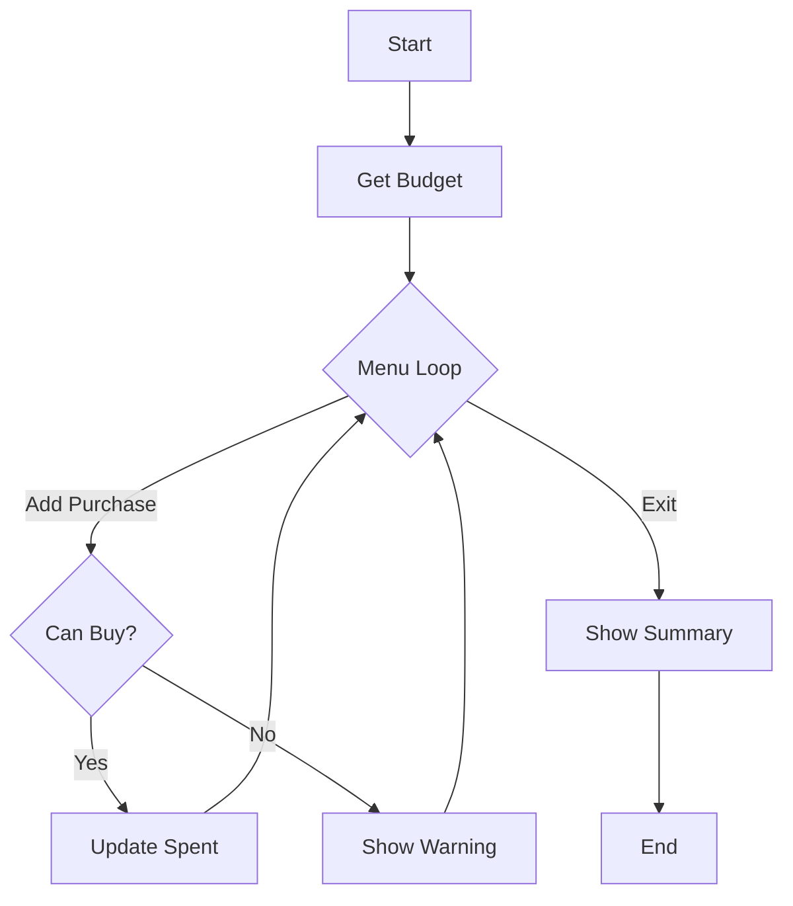

# Lecture Notes: Algorithmic Logic & Introduction to Data Structures

## Learning Objectives
1.  **Translate** real-world requirements into executable logic using pseudo-code and modular functions.
2.  **Implement** state management in an iterative application using `while` loops and conditional branching.
3.  **Distinguish** between local and global variable scope to prevent namespace pollution and logic errors.
4.  **Evaluate** the scalability limits of scalar variables to understand the necessity of data collections.

---

## 1. Building Complex Logic: The Budget Tracker Case Study

### From Mental Model to Pseudo-code
Before writing a single line of Python, you must solve the problem conceptually. Jumping straight into syntax often leads to "spaghetti code." The most effective approach is to draft **pseudo-code**—a plain English description of the program's flow.

In the "Weekly Budget Management" example, the problem breaks down as follows:
*   **Goal**: Track a user's spending against a set weekly budget (e.g., \$100), warn them if they are overspending, and calculate discounts.
*   **Input**: Weekly budget, item names, item prices.
*   **Output**: Remaining balance, status alerts (Status Good/Careful/Over Budget), and final summary.

**The Pseudo-code Structure:**
1.  **Initialize**: Get the weekly budget from the user and set initial spending to zero.
2.  **Loop**: Create a "menu" that repeats until the user chooses to "Exit".
3.  **Options**:
    *   Add a single purchase (check affordability).
    *   Buy multiple items (batch processing until "done").
    *   Calculate a discount to find better deals.
    *   Exit the application.
4.  **Terminate**: Show the final summary including total spent, remaining money, and purchase count.



> 💡 **Pro Tip**: If you can't explain the logic in English (or pseudo-code), you cannot code it in Python. Build the logic first; the syntax is just translation.

### Modularization with Functions
Instead of writing one massive script, you break the logic into small, reusable **functions**. This makes debugging easier and the code cleaner.

**Key Functions Defined:**
*   `show_welcome()`: Prints the UI header and welcome message.
*   `get_budget_status(budget, spent)`: Calculates remaining balance and returns the status based on whether remaining money is above or below 50% of the budget.
*   `can_buy(item_price, remaining)`: Returns `True` if the item price is greater than 0 and less than or equal to the remaining budget.
*   `calculate_discount(price, discount_pct)`: Performs mathematical calculations to show the original price, discount amount, and final price.

---

## 2. Implementing Application Logic

### The Execution Loop
To keep an application running until the user decides to quit, use a `while` loop combined with a control flag or a break condition.

```python
# Pattern for an interactive menu loop
total_spent = 0
budget = float(input("Enter your weekly budget: "))

keep_going = True
while keep_going:
    print("\n--- Menu ---")
    print("1. Add Purchase")
    print("4. Exit")
    choice = input("Choose an option (1-4): ")

    if choice == '4':
        print("Exiting application...")
        keep_going = False # Terminates the loop
    
    elif choice == '1':
        # Logic to add purchase
        pass 
```

### State Management & Validation
You must validate inputs to prevent crashes or illogical data (like negative prices).

**Example: The "Can Buy" Logic**
When a user attempts to buy an item, the program checks if the item is affordable before updating the total spending.

```python
def can_buy(item_price, remaining_budget):
    # Pythonic: Check validity and affordability in one step
    return 0 < item_price <= remaining_budget
```

### Formatting Output
When dealing with currency, precision matters. To avoid seeing long decimal strings like \$33.333333, use formatting to round floats to two decimal places.

*   **Method 1**: `round(value, 2)`
*   **Method 2**: F-string formatting `{value:.2f}` (e.g., `f"Remaining: \${remaining:.2f}"`)

$$Remaining = Budget - Spent$$

---

## 3. Variable Scope: Local vs. Global

### The Concept of Scope
**Scope** determines where a variable can be seen and accessed within your code.
*   **Global Scope**: Variables defined outside all functions. These are accessible throughout the script.
*   **Local Scope**: Variables defined *inside* a function. Only that specific function can see them. When the function finishes executing, these variables are no longer available.

### Local Variables
Variables created inside a function are **local** by default. They are isolated from the rest of the program.

```python
def my_function():
    local_var = 10  # Created here
    print(local_var) # Works fine

my_function()
# print(local_var)  # ERROR: NameError. 'local_var' is not defined in the global scope.
```

### Global Variables
Variables created at the main level of the script are **global**. While you can read them inside a function, modifying them requires the `global` keyword.

**Modifying a Global (Requires Keyword):**
To update a global variable like `total_spent` inside a function, you must explicitly declare it.

```python
counter = 0

def increment():
    global counter  # Tells Python to use the global variable 'counter'
    counter += 1    

increment()
print(counter) # Output: 1
```

### Synthesis Point
**Minimize the use of Global Variables.** While they are sometimes necessary for state management in simple scripts, they can make code unpredictable. It is generally better to pass data into functions as **arguments** and use **return** values to send data back to the main program.

---

## 4. The Necessity of Data Structures

### The Scalability Problem
The Budget Tracker managed simple values like `total_spent` and `purchase_count` using single (scalar) variables. However, as the complexity of the data grows, this approach becomes inefficient.

**Scenario**: You need to track 1,000 different student grades or a long list of individual shopping items.
*   **Small Scale**: You might create `item1`, `item2`, and `item3`.
*   **Large Scale**: Creating hundreds or thousands of individual variables is impossible to manage.

### The Limitation of Scalar Variables
Using individual variables for large datasets is:
1.  **Not Scalable**: You cannot easily write code that handles a variable number of inputs.
2.  **Hard to Process**: You cannot effectively use loops to iterate through individual variable names.
3.  **Prone to Error**: Managing a massive number of unique variable names leads to significant bugs.

### The Solution: Data Collections
Python provides **Data Structures** such as Lists, Dictionaries, Tuples, and Sets to store collections of data under a single name. This enables the program to handle variable amounts of data using loops and modular logic.

#### Data Science Context: Scalars vs. Vectors
While scalar variables work for simple logic, data science relies on structures like Lists or NumPy arrays. In machine learning, a dataset is often represented as a matrix where rows are observations and columns are features. Managing these as thousands of individual scalar variables (`feature1_row1`, `feature1_row2`) is impossible. Data structures allow operations on entire vectors of data efficiently.

#### Performance Implications (Big O)
Choosing the right data structure impacts performance as data scales.

| Operation | List (Array) | Dictionary (Hash Map) |
| :--- | :--- | :--- |
| **Access** | $O(1)$ (by index) | $O(1)$ (by key) |
| **Search** | $O(n)$ (linear scan) | $O(1)$ (average case) |
| **Insertion** | $O(1)$ (append) | $O(1)$ (average case) |

*   **Lists** are ideal for ordered sequences (e.g., time-series data).
*   **Dictionaries** provide fast lookups for unstructured key-value pairs (e.g., feature mapping).

> **Note on Performance**: Dictionaries achieve $O(1)$ speed through **hashing**—computing a direct address for the data. Lists require a **linear scan** ($O(n)$), checking every element one by one until a match is found.

---

### Key Takeaways
1.  **Pseudo-code is Mandatory**: Always draft your logic in plain English before writing code. This helps identify logical flaws early.
2.  **Modular Design**: Break the program into specific functions (e.g., `show_welcome`, `can_buy`) to make the code organized and easier to debug.
3.  **Input Validation**: Check user inputs (e.g., ensuring budget and prices are \$>0) to prevent logic errors.
4.  **Scope Isolation**: Variables inside functions are **local** and protected from accidental changes by other parts of the program.
5.  **Scalability**: Scalar variables work for single values, but **Data Structures** are required to handle collections of data, such as a list of purchases or student records.